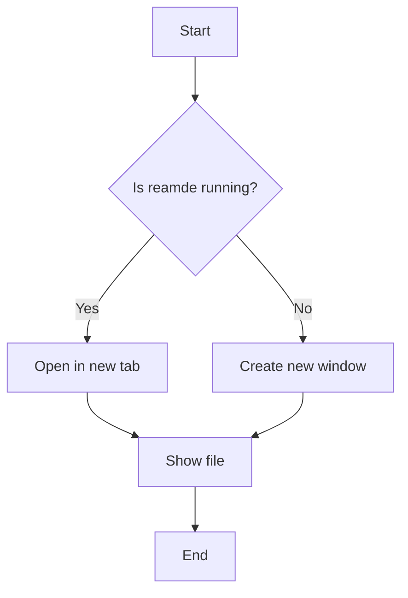
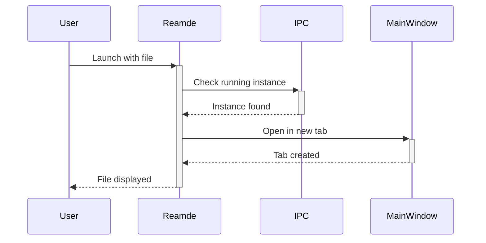

# Demo File 1: Basic Markdown Features

This is a test file for demonstrating the **reamde** markdown viewer.

## Headings

### Level 3 Heading
#### Level 4 Heading

## Text Formatting

- **Bold text**
- *Italic text*
- ***Bold and italic***
- ~~Strikethrough~~
- `Inline code`

## Lists

### Unordered List
- Item 1
- Item 2
  - Nested item 2.1
  - Nested item 2.2
- Item 3

### Ordered List
1. First item
2. Second item
3. Third item
   1. Nested 3.1
   2. Nested 3.2

### Task List
- [x] Completed task
- [ ] Pending task
- [ ] Another task

## Links and Images

[Visit VFWidgets on GitHub](https://github.com)

## Code Blocks

### Python Example

```python
def hello_world():
    """A simple hello world function."""
    print("Hello from reamde!")
    return True

if __name__ == "__main__":
    hello_world()
```

### JavaScript Example

```javascript
function fibonacci(n) {
    if (n <= 1) return n;
    return fibonacci(n - 1) + fibonacci(n - 2);
}

console.log(fibonacci(10));
```

## Blockquotes

> This is a blockquote.
> It can span multiple lines.
>
> > Nested blockquotes are also supported.

## Tables

| Feature | Supported | Notes |
|---------|-----------|-------|
| Markdown | ✅ | Full CommonMark support |
| Syntax Highlighting | ✅ | 300+ languages |
| Math | ✅ | KaTeX support |
| Diagrams | ✅ | Mermaid.js |
| Single Instance | ✅ | Only one window |

## Horizontal Rule

---

## Math (KaTeX)

Inline math: $E = mc^2$

Block math:

$$
\frac{-b \pm \sqrt{b^2 - 4ac}}{2a}
$$

## Mermaid Diagram



## Sequence Diagram



## Summary

This demo shows that reamde supports:

1. ✅ All standard markdown features
2. ✅ Syntax highlighting for code
3. ✅ Mathematical equations
4. ✅ Mermaid diagrams
5. ✅ Tables and formatting
6. ✅ Task lists
7. ✅ Nested structures

**Try opening another file while this one is open to see the single-instance behavior!**
