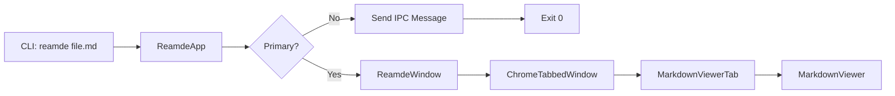
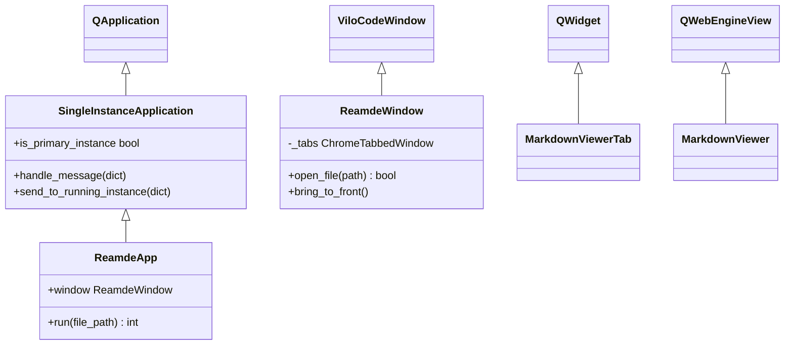

# Demo File 2: Single-Instance Testing

This file is for testing the **single-instance behavior** of reamde.

## What Should Happen

When you open this file while DEMO1.md is already open:

1. ✅ No new window should open
2. ✅ A new tab should appear in the existing window
3. ✅ The new tab should be automatically focused
4. ✅ Window should come to front if it was behind other windows

## Testing Instructions

### Test 1: Basic Single Instance

```bash
# Terminal 1: Open first file
$ reamde DEMO1.md

# Terminal 2: Open second file (should open in same window)
$ reamde DEMO2.md
```

**Expected**: Both files in tabs of the same window.

### Test 2: Cross-Directory

```bash
# From directory A
$ cd ~/some/path
$ reamde DEMO1.md

# From directory B
$ cd ~/another/path
$ reamde DEMO2.md
```

**Expected**: Still opens in the same window!

### Test 3: Rapid Launch

```bash
# Launch multiple files quickly
$ reamde DEMO1.md & reamde DEMO2.md & reamde README.md
```

**Expected**: One window with three tabs.

## Architecture Behind This

### IPC Communication

```
Secondary Instance                Primary Instance
     [Launch]                          [Running]
        |                                  |
        | 1. Connect to                   |
        |    /tmp/vfwidgets-reamde-user   |
        |--------------------------------->|
        |                                  |
        | 2. Send JSON message             |
        |    {"action": "open",            |
        |     "file": "/path/DEMO2.md"}    |
        |--------------------------------->|
        |                                  | 3. Open in new tab
        |                                  | 4. Focus tab
        | 5. ACK received                  | 5. Bring to front
        |<---------------------------------|
        |                                  |
     [Exit 0]                          [Continue]
```

### Message Protocol

```json
{
  "action": "open",
  "file": "/absolute/path/to/DEMO2.md"
}
```

## Code Snippet

Here's how it works in the code:

```python
# In ReamdeApp.handle_message()
def handle_message(self, message: dict) -> None:
    action = message.get("action")

    if action == "open":
        file_path = message.get("file")
        if file_path and self.window:
            # Open file in new tab
            self.window.open_file(file_path, focus=True)
            # Bring window to front
            self.window.bring_to_front()
```

## More Diagrams

### Component Flow



### Class Hierarchy



## Summary

If you're seeing this in a **new tab** rather than a new window, the single-instance feature is working correctly! 🎉

**Now try closing this tab and opening it again from the terminal.**
