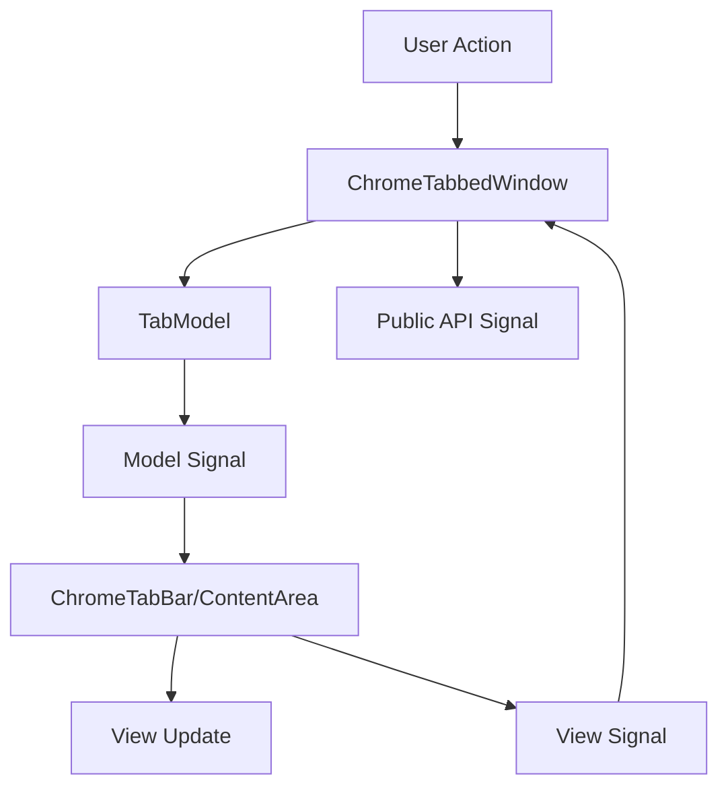

# ChromeTabbedWindow Architecture (v1.0)

## Overview

This document describes the internal architecture of ChromeTabbedWindow for maintainers and contributors. The design follows strict MVC patterns and Qt best practices to ensure maintainability and future extensibility.

## Design Principles

1. **Strict MVC Separation**: Model, View, and Controller are clearly separated
2. **Qt-Idiomatic**: Follows Qt patterns (properties, signals/slots, parent-child)
3. **Composition Over Inheritance**: Uses composition for flexibility
4. **Strategy Pattern**: Platform-specific behavior via strategies
5. **Future-Ready**: Internal hooks for v2.0 features without breaking v1.0 API

## Component Architecture

```
ChromeTabbedWindow (Controller)
    ├── TabModel (Model)
    │   ├── TabData[]
    │   ├── TabOrder
    │   └── TabState
    ├── ChromeTabBar (View)
    │   ├── TabRenderer
    │   ├── TabAnimator
    │   └── TabDragHandler
    ├── TabContentArea (View)
    │   ├── QStackedWidget
    │   └── FocusManager
    └── PlatformAdapter (Platform Strategy)
        ├── WindowsPlatform
        ├── MacOSPlatform
        ├── LinuxX11Platform
        ├── LinuxWaylandPlatform
        └── WSLPlatform
```

## Core Components

### ChromeTabbedWindow (Controller)

The main class that orchestrates all components and provides the public API.

```python
class ChromeTabbedWindow(QWidget):
    """
    Controller that coordinates Model and View components.
    Provides QTabWidget-compatible API.
    """

    def __init__(self, parent=None):
        super().__init__(parent)

        # Component initialization (composition)
        self._model = TabModel()
        self._tab_bar = self._create_tab_bar()
        self._content_area = self._create_content_area()
        self._platform = self._create_platform_adapter()

        # Layout setup
        self._setup_layout()

        # Signal connections
        self._connect_signals()

    # Factory methods for future customization
    def _create_tab_bar(self) -> ChromeTabBar:
        """Factory method for tab bar creation"""
        return ChromeTabBar(self)

    def _create_content_area(self) -> TabContentArea:
        """Factory method for content area creation"""
        return TabContentArea(self)

    def _create_platform_adapter(self) -> IPlatformAdapter:
        """Factory method for platform adapter creation"""
        return PlatformFactory.create(self)
```

### TabModel (Model Layer)

Manages tab data and state, independent of presentation.

```python
class TabModel(QObject):
    """
    Model layer managing tab data and state.
    Emits signals when data changes.
    """

    # Signals for MVC communication
    tabAdded = Signal(int, TabData)
    tabRemoved = Signal(int, TabData)
    tabMoved = Signal(int, int)
    tabDataChanged = Signal(int, str)  # index, property_name
    currentTabChanged = Signal(int, int)  # old, new

    def __init__(self):
        super().__init__()
        self._tabs: List[TabData] = []
        self._current_index: int = -1

    # Data management
    def add_tab(self, widget: QWidget, text: str) -> int:
        """Add a new tab to the model"""

    def remove_tab(self, index: int) -> Optional[TabData]:
        """Remove a tab from the model"""

    def get_tab(self, index: int) -> Optional[TabData]:
        """Get tab data at index"""

    def set_current(self, index: int) -> bool:
        """Set current tab index"""

@dataclass
class TabData:
    """
    Data structure for a single tab.
    Separates required QTabWidget fields from internal metadata.
    """
    # QTabWidget compatible fields
    widget: QWidget
    text: str
    icon: QIcon = QIcon()
    tooltip: str = ""
    whats_this: str = ""
    enabled: bool = True
    visible: bool = True
    data: Any = None

    # Internal fields (not exposed in v1.0)
    _id: str = field(default_factory=lambda: str(uuid.uuid4()))
    _created_at: datetime = field(default_factory=datetime.now)
    _metadata: dict = field(default_factory=dict)
    _state: dict = field(default_factory=dict)
```

### ChromeTabBar (View Layer - Tab Strip)

Renders the Chrome-style tab bar.

```python
class ChromeTabBar(QWidget):
    """
    Chrome-style tab bar widget.
    Handles rendering, animations, and user interactions.
    """

    # User interaction signals
    tabClicked = Signal(int)
    tabDoubleClicked = Signal(int)
    tabCloseRequested = Signal(int)
    tabMoved = Signal(int, int)  # from, to
    newTabRequested = Signal()

    def __init__(self, parent=None):
        super().__init__(parent)

        self._renderer = TabRenderer(self)
        self._animator = TabAnimator(self)
        self._drag_handler = TabDragHandler(self)

        # Visual state
        self._hover_index = -1
        self._pressed_index = -1
        self._animation_progress = {}

    def set_model(self, model: TabModel):
        """Connect to model for data"""
        self._model = model
        model.tabAdded.connect(self._on_tab_added)
        model.tabRemoved.connect(self._on_tab_removed)
        model.tabDataChanged.connect(self._on_tab_data_changed)

    def paintEvent(self, event: QPaintEvent):
        """Custom Chrome-style painting"""

    def mousePressEvent(self, event: QMouseEvent):
        """Handle tab selection and dragging"""

    def mouseReleaseEvent(self, event: QMouseEvent):
        """Handle tab clicks"""

    def mouseMoveEvent(self, event: QMouseEvent):
        """Handle hover effects and dragging"""
```

### TabContentArea (View Layer - Content)

Manages the content area where tab widgets are displayed.

```python
class TabContentArea(QWidget):
    """
    Content area that displays the current tab's widget.
    Uses QStackedWidget internally.
    """

    def __init__(self, parent=None):
        super().__init__(parent)

        self._stack = QStackedWidget(self)
        self._focus_manager = FocusManager()

        layout = QVBoxLayout(self)
        layout.setContentsMargins(0, 0, 0, 0)
        layout.addWidget(self._stack)

    def add_widget(self, widget: QWidget) -> int:
        """Add widget to the stack"""
        return self._stack.addWidget(widget)

    def remove_widget(self, widget: QWidget):
        """Remove widget from the stack"""
        self._stack.removeWidget(widget)

    def set_current_widget(self, widget: QWidget):
        """Show the specified widget"""
        self._stack.setCurrentWidget(widget)

    def current_widget(self) -> QWidget:
        """Get the current widget"""
        return self._stack.currentWidget()
```

## Platform Abstraction Layer

### Platform Strategy Interface

```python
class IPlatformAdapter(Protocol):
    """
    Interface for platform-specific behavior.
    Implementations provide platform-specific window management.
    """

    def get_capabilities(self) -> PlatformCapabilities:
        """Return platform capabilities"""
        ...

    def setup_window(self, window: QWidget) -> None:
        """Configure window for the platform"""
        ...

    def start_system_move(self, window: QWidget) -> None:
        """Start native window move operation"""
        ...

    def start_system_resize(self, window: QWidget, edge: Qt.Edge) -> None:
        """Start native window resize operation"""
        ...

    def update_window_controls(self, window: QWidget) -> None:
        """Update minimize/maximize/close buttons"""
        ...

@dataclass
class PlatformCapabilities:
    """Platform capability detection results"""
    supports_frameless: bool = False
    supports_system_move: bool = False
    supports_system_resize: bool = False
    supports_client_side_decorations: bool = False
    has_native_shadows: bool = False
    requires_composition: bool = False
    xdg_portals_available: bool = False
    running_under_wsl: bool = False
```

### Platform Factory

```python
class PlatformFactory:
    """
    Factory for creating platform-specific adapters.
    Auto-detects the current platform.
    """

    @staticmethod
    def create(window: QWidget) -> IPlatformAdapter:
        """Create appropriate platform adapter"""

        system = platform.system()

        if system == "Windows":
            return WindowsPlatformAdapter(window)
        elif system == "Darwin":
            return MacOSPlatformAdapter(window)
        elif system == "Linux":
            if PlatformFactory._is_wsl():
                return WSLPlatformAdapter(window)
            elif PlatformFactory._is_wayland():
                return LinuxWaylandAdapter(window)
            else:
                return LinuxX11Adapter(window)
        else:
            return FallbackPlatformAdapter(window)

    @staticmethod
    def _is_wsl() -> bool:
        """Detect if running under WSL"""
        return "microsoft" in platform.release().lower()

    @staticmethod
    def _is_wayland() -> bool:
        """Detect if running under Wayland"""
        return os.environ.get("XDG_SESSION_TYPE") == "wayland"
```

## Rendering Pipeline

### Tab Rendering

```python
class TabRenderer:
    """
    Handles Chrome-style tab rendering.
    Manages paint operations and visual states.
    """

    def draw_tab(self, painter: QPainter, rect: QRect,
                  data: TabData, state: TabState) -> None:
        """Draw a single tab with Chrome styling"""

        # Draw tab background
        self._draw_tab_background(painter, rect, state)

        # Draw tab content
        self._draw_tab_icon(painter, rect, data.icon)
        self._draw_tab_text(painter, rect, data.text)

        # Draw close button if needed
        if state.closable:
            self._draw_close_button(painter, rect, state)

    def _draw_tab_background(self, painter: QPainter,
                             rect: QRect, state: TabState):
        """Draw Chrome-style tab background with curves"""

        path = QPainterPath()

        # Chrome-style tab shape with curves
        # Top-left curve
        path.moveTo(rect.left(), rect.bottom())
        path.quadTo(rect.left(), rect.top() + 4,
                   rect.left() + 4, rect.top() + 4)

        # Top edge
        path.lineTo(rect.right() - 4, rect.top() + 4)

        # Top-right curve
        path.quadTo(rect.right(), rect.top() + 4,
                   rect.right(), rect.bottom())

        # Paint based on state
        if state.selected:
            painter.fillPath(path, self._get_selected_brush())
        elif state.hovered:
            painter.fillPath(path, self._get_hover_brush())
        else:
            painter.fillPath(path, self._get_normal_brush())
```

### Animation System

```python
class TabAnimator:
    """
    Manages tab animations for smooth transitions.
    """

    def __init__(self, tab_bar: ChromeTabBar):
        self._tab_bar = tab_bar
        self._animations: Dict[str, QPropertyAnimation] = {}

    def animate_tab_insert(self, index: int) -> None:
        """Animate new tab insertion"""

        animation = QPropertyAnimation()
        animation.setDuration(200)
        animation.setEasingCurve(QEasingCurve.OutCubic)
        # ... setup animation
        animation.start()

    def animate_tab_removal(self, index: int) -> None:
        """Animate tab removal with collapse effect"""

    def animate_tab_move(self, from_index: int, to_index: int) -> None:
        """Animate tab reordering"""
```

## Event Handling

### Focus Management

```python
class FocusManager:
    """
    Manages focus restoration when switching tabs.
    """

    def __init__(self):
        self._focus_history: Dict[QWidget, QWidget] = {}

    def save_focus(self, tab_widget: QWidget) -> None:
        """Save the currently focused widget within a tab"""

        focused = QApplication.focusWidget()
        if focused and focused.isAncestorOf(tab_widget):
            self._focus_history[tab_widget] = focused

    def restore_focus(self, tab_widget: QWidget) -> None:
        """Restore focus to the previously focused widget"""

        if tab_widget in self._focus_history:
            widget = self._focus_history[tab_widget]
            if widget and not widget.isHidden():
                widget.setFocus()
```

### Drag and Drop

```python
class TabDragHandler:
    """
    Handles tab reordering via drag and drop.
    """

    def __init__(self, tab_bar: ChromeTabBar):
        self._tab_bar = tab_bar
        self._drag_start_pos = None
        self._dragging_index = -1

    def start_drag(self, index: int, pos: QPoint) -> None:
        """Start dragging a tab"""

    def update_drag(self, pos: QPoint) -> None:
        """Update drag visualization"""

    def finish_drag(self, pos: QPoint) -> None:
        """Complete the drag operation"""
```

## Resource Management

### Resource Manager

```python
class ResourceManager:
    """
    Centralized resource management.
    Singleton pattern for shared resources.
    """

    _instance = None

    def __new__(cls):
        if cls._instance is None:
            cls._instance = super().__new__(cls)
            cls._instance._initialize()
        return cls._instance

    def _initialize(self):
        self._icon_cache: Dict[str, QIcon] = {}
        self._pixmap_cache: Dict[str, QPixmap] = {}
        self._stylesheet_cache: Dict[str, str] = {}

    @lru_cache(maxsize=128)
    def get_icon(self, name: str, size: QSize = QSize(16, 16)) -> QIcon:
        """Get cached icon"""

    @lru_cache(maxsize=32)
    def get_stylesheet(self, theme: str = "default") -> str:
        """Get cached stylesheet"""
```

## Configuration System

### Internal Configuration

```python
class WindowConfig:
    """
    Internal configuration (not exposed in v1.0).
    Prepared for future customization.
    """

    # QTabWidget compatible settings
    tabs_closable: bool = False
    movable: bool = False
    document_mode: bool = False
    elide_mode: Qt.TextElideMode = Qt.ElideRight
    uses_scroll_buttons: bool = True

    # Chrome-specific settings (internal)
    _animation_duration: int = 200
    _tab_min_width: int = 100
    _tab_max_width: int = 250
    _tab_height: int = 36
    _new_tab_button: bool = True
    _show_window_controls: bool = True

    # Platform overrides (internal)
    _force_native_decorations: bool = False
    _edge_resize_margin: int = 8

    def to_dict(self) -> dict:
        """Serialize configuration"""

    @classmethod
    def from_dict(cls, data: dict) -> "WindowConfig":
        """Deserialize configuration"""
```

## Signal Flow

### Signal Chain for Tab Operations



Example: Adding a Tab
1. User calls `window.addTab(widget, "Title")`
2. Controller validates input
3. Controller calls `model.add_tab(widget, "Title")`
4. Model updates internal state
5. Model emits `tabAdded` signal
6. View receives signal and updates display
7. Controller emits public `currentChanged` signal if needed

## Memory Management

### Object Ownership

Following Qt's parent-child ownership model:

```python
class ChromeTabbedWindow(QWidget):
    def addTab(self, widget: QWidget, label: str) -> int:
        """
        Add a tab. Widget becomes child of content area.
        """
        # Widget reparenting
        widget.setParent(self._content_area.widget())

        # Model just stores reference
        index = self._model.add_tab(widget, label)

        return index

    def removeTab(self, index: int) -> None:
        """
        Remove tab. Widget's parent is cleared but not deleted.
        """
        tab_data = self._model.remove_tab(index)
        if tab_data:
            # Clear parent but don't delete
            tab_data.widget.setParent(None)
```

### Resource Cleanup

```python
class ChromeTabbedWindow(QWidget):
    def closeEvent(self, event: QCloseEvent) -> None:
        """
        Cleanup on window close.
        """
        # Stop all animations
        self._tab_bar._animator.stop_all()

        # Clear caches
        ResourceManager().clear_caches()

        # Emit cleanup signals for extensions
        self._cleanup_signal.emit()

        super().closeEvent(event)
```

## Performance Considerations

### Optimization Strategies

1. **Lazy Loading**: Tab content created only when needed
2. **Virtual Painting**: Only visible tabs are painted
3. **Animation Throttling**: Limit concurrent animations
4. **Cache Management**: LRU caches for resources
5. **Event Coalescing**: Batch rapid updates

```python
class PerformanceOptimizer:
    """
    Performance optimization utilities.
    """

    @staticmethod
    def debounce(wait: int):
        """Decorator to debounce method calls"""
        def decorator(fn):
            timer = None
            def debounced(*args, **kwargs):
                nonlocal timer
                if timer:
                    timer.stop()
                timer = QTimer.singleShot(wait,
                    lambda: fn(*args, **kwargs))
            return debounced
        return decorator

    @staticmethod
    def measure_performance(fn):
        """Decorator to measure method performance"""
        def wrapper(*args, **kwargs):
            start = time.perf_counter()
            result = fn(*args, **kwargs)
            elapsed = (time.perf_counter() - start) * 1000
            if elapsed > 50:  # Log slow operations
                logger.warning(f"{fn.__name__} took {elapsed:.1f}ms")
            return result
        return wrapper
```

## Testing Infrastructure

### Test Helpers

```python
class ChromeTabbedWindowTestHelper:
    """
    Test utilities for ChromeTabbedWindow.
    Exposes internals for testing.
    """

    @staticmethod
    def create_test_window() -> ChromeTabbedWindow:
        """Create window suitable for testing"""
        window = ChromeTabbedWindow()
        window.setAttribute(Qt.WA_DontShowOnScreen)
        return window

    @staticmethod
    def get_model(window: ChromeTabbedWindow) -> TabModel:
        """Access internal model for testing"""
        return window._model

    @staticmethod
    def get_tab_bar(window: ChromeTabbedWindow) -> ChromeTabBar:
        """Access internal tab bar for testing"""
        return window._tab_bar

    @staticmethod
    def simulate_tab_click(window: ChromeTabbedWindow, index: int):
        """Simulate clicking on a tab"""
        tab_bar = window._tab_bar
        rect = tab_bar._get_tab_rect(index)
        event = QMouseEvent(QEvent.MouseButtonPress,
                           rect.center(), Qt.LeftButton,
                           Qt.LeftButton, Qt.NoModifier)
        tab_bar.mousePressEvent(event)
```

## Future Extension Points (v2.0+)

While not exposed in v1.0, the architecture includes hooks for future features:

### Service Layer (Future)

```python
class TabServices:
    """
    Services for tab widgets (v2.0).
    Currently internal, will be exposed in future versions.
    """

    def __init__(self, window: ChromeTabbedWindow):
        self._window = window
        self._message_bus = MessageBus()
        self._settings = SettingsManager()

    # Future service methods
    def broadcast_message(self, message: Any): ...
    def get_settings(self) -> SettingsManager: ...
```

### Plugin System (Future)

```python
class ITabPlugin(Protocol):
    """
    Plugin interface (v2.0).
    Currently internal, for future extensibility.
    """

    def on_window_created(self, window: ChromeTabbedWindow): ...
    def on_tab_added(self, index: int, widget: QWidget): ...
    def contribute_actions(self) -> List[QAction]: ...
```

## Best Practices for Contributors

1. **Maintain MVC Separation**: Never mix model logic with view code
2. **Use Signals**: Communication between components via signals
3. **Follow Qt Patterns**: Use properties, parent-child, deleteLater
4. **Test Coverage**: All public methods must have tests
5. **Performance**: Measure operations that might exceed 50ms
6. **Documentation**: Update architecture.md for significant changes
7. **Backward Compatibility**: Never break v1.0 API

## See Also

- [API Reference](api.md) - Public API documentation
- [Usage Guide](usage.md) - User-facing examples
- [Platform Notes](platform-notes.md) - Platform-specific details
- [Extension Guide](extension-guide.md) - Future extensibility