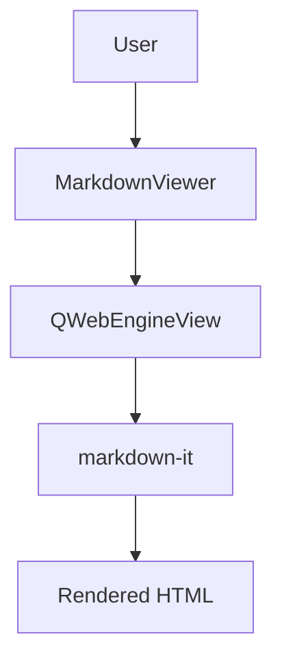

# VFWidgets Markdown Widget

A collection of PySide6 markdown widgets including a powerful viewer with support for diagrams (Mermaid), syntax highlighting (Prism.js), and math equations (KaTeX).

## Features

- 📝 **Full Markdown Support** - CommonMark + GFM extensions
- 📊 **Mermaid Diagrams** - Flowcharts, sequence diagrams, Gantt charts, and more
- 🎨 **Syntax Highlighting** - 300+ languages via Prism.js
- 🔢 **Math Equations** - LaTeX math rendering via KaTeX
- 🖼️ **Image Support** - Base64, local files, and URLs
- 🎭 **Theme Integration** - Optional vfwidgets-theme support
- 📚 **TOC API** - Programmatic table of contents extraction
- 🔗 **Editor Ready** - Hooks for live preview and synchronization
- ⚡ **High Performance** - Debounced rendering, sync mode
- 📦 **Fully Offline** - All JavaScript libraries bundled locally
- 🎯 **Export** - HTML and PDF export functionality

## Installation

```bash
# Install from local path
pip install ./widgets/markdown_widget

# Install in editable mode for development
pip install -e ./widgets/markdown_widget

# Install with development dependencies
pip install -e "./widgets/markdown_widget[dev]"

# Install with optional features
pip install -e "./widgets/markdown_widget[theme,keybinding]"
```

## Quick Start

### Basic Viewer

```python
from PySide6.QtWidgets import QApplication, QMainWindow
from vfwidgets_markdown import MarkdownViewer

app = QApplication([])
window = QMainWindow()

# Create viewer and set content
viewer = MarkdownViewer()
viewer.set_markdown("# Hello World\\n\\nThis is **markdown** with *formatting*!")

window.setCentralWidget(viewer)
window.resize(800, 600)
window.show()

app.exec()
```

### Load from File

```python
viewer = MarkdownViewer()
viewer.load_file("README.md")
```

### Mermaid Diagrams

````python
viewer.set_markdown(\"\"\"
# System Architecture


\"\"\")
````

### Math Equations

```python
viewer.set_markdown(\"\"\"
# Physics

Inline equation: $E = mc^2$

Block equation:
$$
\\int_0^\\infty e^{-x^2} dx = \\frac{\\sqrt{\\pi}}{2}
$$
\"\"\")
```

### Syntax Highlighting

````python
viewer.set_markdown(\"\"\"
# Code Example

```python
def factorial(n):
    if n <= 1:
        return 1
    return n * factorial(n - 1)
```
\"\"\")
````

## Advanced Usage

### Live Preview Editor

```python
from PySide6.QtWidgets import QSplitter, QPlainTextEdit
from vfwidgets_markdown import MarkdownViewer

# Create split view
splitter = QSplitter()

# Editor on left
editor = QPlainTextEdit()
editor.setPlainText("# Start typing...")

# Viewer on right
viewer = MarkdownViewer()
viewer.enable_sync_mode()  # Preserve scroll position
viewer.set_debounce_delay(300)  # Wait 300ms before rendering

# Connect editor to viewer
editor.textChanged.connect(lambda: viewer.set_markdown(editor.toPlainText()))

splitter.addWidget(editor)
splitter.addWidget(viewer)
splitter.show()
```

### Custom TOC Sidebar

```python
from PySide6.QtWidgets import QTreeWidget, QTreeWidgetItem

# Create TOC tree
toc_tree = QTreeWidget()
viewer = MarkdownViewer()

def update_toc(toc):
    \"\"\"Update TOC sidebar when content changes.\"\"\"
    toc_tree.clear()
    for heading in toc:
        item = QTreeWidgetItem([heading['text']])
        item.setData(0, Qt.ItemDataRole.UserRole, heading['id'])
        toc_tree.addTopLevelItem(item)

def on_toc_click(item):
    \"\"\"Scroll to heading when clicked.\"\"\"
    heading_id = item.data(0, Qt.ItemDataRole.UserRole)
    viewer.scroll_to_heading(heading_id)

# Connect signals
viewer.toc_changed.connect(update_toc)
toc_tree.itemClicked.connect(on_toc_click)

viewer.set_markdown("# Introduction\\n## Section 1\\n### Subsection")
```

### Image Handling

```python
# Set base path for relative images
viewer.set_base_path("/home/user/docs")
viewer.set_markdown("")  # Resolved to /home/user/docs/images/logo.png

# Custom image resolver
def custom_resolver(path: str) -> str:
    if path.startswith("http"):
        return path  # Allow web URLs
    return f"/custom/path/{path}"

viewer.set_image_resolver(custom_resolver)

# Base64 embedded images work automatically
viewer.set_markdown("")
```

### Theme Support

```python
# Manual theme
viewer.set_theme("dark")
viewer.set_syntax_theme("vscode-dark")

# With vfwidgets-theme (optional)
from vfwidgets_theme import ThemedApplication

app = ThemedApplication(sys.argv)
app.set_theme("dark")

viewer = MarkdownViewer()  # Automatically uses dark theme
```

### Export Functionality

```python
# Export to HTML
html = viewer.export_html()
with open("output.html", "w") as f:
    f.write(html)

# Export to PDF
viewer.export_pdf("output.pdf")

# Auto-detect format
viewer.export_to_file("document.html", "html")
viewer.export_to_file("document.pdf", "pdf")
```

## Supported Markdown Features

### Basic Syntax
- Headings (`# H1` through `###### H6`)
- Bold (`**bold**`), Italic (`*italic*`)
- Links (`[text](url)`), Images (``)
- Lists (ordered and unordered)
- Blockquotes (`> quote`)
- Code blocks and inline code
- Horizontal rules

### Extended Syntax
- ✅ Task lists: `- [x] Done` `- [ ] Todo`
- 📊 Tables (GFM style)
- ~~Strikethrough~~ (`~~deleted~~`)
- Footnotes (`[^1]` and `[^1]: Note`)
- Definition lists
- Abbreviations
- Subscript (`H~2~O`), Superscript (`X^2^`)
- ++Inserted++ text (`++inserted++`)
- ==Highlighted== text (`==marked==`)
- :smile: Emoji (`:smile:`, `:rocket:`)

### Advanced Features
- 📊 **Mermaid Diagrams**: Flowcharts, sequence, Gantt, class, state, ER, mind maps
- 🎨 **Syntax Highlighting**: 300+ languages with Prism.js
- 🔢 **Math Equations**: Inline `$...$` and block `$$...$$` LaTeX

## API Overview

### Content Methods
- `set_markdown(content: str)` - Set markdown content
- `load_file(path: str)` - Load from file

### Navigation
- `get_toc() → list[dict]` - Extract table of contents
- `scroll_to_heading(id: str)` - Scroll to heading
- `scroll_to_line(line: int)` - Scroll to line
- `scroll_to_percentage(pct: float)` - Scroll to position

### Image Handling
- `set_base_path(path: str)` - Set base directory for relative paths
- `set_image_resolver(callback)` - Custom image resolution

### Theme & Styling
- `set_theme(theme: str)` - Set viewer theme
- `set_syntax_theme(theme: str)` - Set syntax highlighting theme
- `inject_css(css: str)` - Inject custom CSS

### Editor Integration
- `enable_sync_mode()` - Preserve scroll on updates
- `set_debounce_delay(ms: int)` - Debounce rendering

### Export
- `export_html() → str` - Export as HTML
- `export_pdf(path: str)` - Export as PDF

### Signals
- `content_loaded` - Emitted when rendering completes
- `toc_changed(list)` - Emitted when TOC changes
- `heading_clicked(str)` - Emitted on heading click
- `link_clicked(str)` - Emitted on link click
- `scroll_position_changed(float)` - Emitted on scroll
- `rendering_failed(str)` - Emitted on error

## Documentation

- **[API Reference](docs/API.md)** - Complete API documentation
- **[Architecture](docs/ARCHITECTURE.md)** - System architecture and design
- **[Implementation Plan](wip/markdown-viewer-IMPLEMENTATION.md)** - Development roadmap

## Examples

Check the `examples/` directory for complete examples:

- `01_basic_viewer.py` - Simple markdown viewer
- `02_live_preview.py` - Split editor with live preview
- `03_toc_sidebar.py` - Custom TOC sidebar
- `04_themed_viewer.py` - Theme integration
- `05_image_support.py` - Image handling
- `06_export.py` - Export to HTML/PDF

## Development

```bash
# Install in development mode
cd widgets/markdown_widget
pip install -e ".[dev]"

# Run tests
pytest

# Format code
black src/

# Lint
ruff check src/

# Type check
mypy src/
```

## JavaScript Libraries

All bundled locally for offline use:

- **markdown-it** (~50KB) - Markdown parser
- **Mermaid.js** (~200KB) - Diagram rendering
- **Prism.js** (~15KB) - Syntax highlighting
- **KaTeX** (~100KB) - Math rendering
- **markdown-it plugins** (~20KB) - Extensions

**Total Bundle**: ~385KB

## Performance

- **Initial render**: <200ms for 10KB document
- **Live update**: <100ms (debounced)
- **TOC extraction**: <50ms
- **Large documents**: No size limits (may be slow for >10MB)

## Requirements

- Python 3.9+
- PySide6 6.9.0+

**Optional:**
- `vfwidgets-theme-system` - Theme integration
- `vfwidgets-keybinding` - Keyboard shortcuts

## License

MIT License - See LICENSE file for details.

## Contributing

This widget is part of the VFWidgets collection. See the main repository for contribution guidelines.

## Related Widgets

- **[terminal_widget](../terminal_widget/)** - Terminal emulator (similar WebView architecture)
- **[theme_system](../theme_system/)** - Theme management
- **[keybinding_manager](../keybinding_manager/)** - Keyboard shortcuts
