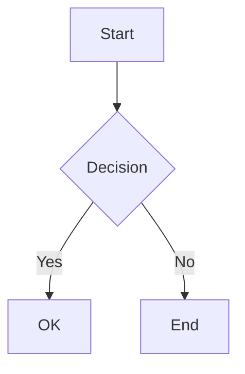

# Markdown Viewer - API Reference

Complete API reference for the MarkdownViewer widget.

## Class: MarkdownViewer

```python
from vfwidgets_markdown import MarkdownViewer
```

Main markdown viewer widget class extending `QWebEngineView`.

### Constructor

```python
MarkdownViewer(parent: QWidget | None = None)
```

Creates a new markdown viewer widget.

**Parameters:**
- `parent` (QWidget | None): Parent widget. Default: None

**Example:**
```python
viewer = MarkdownViewer()
```

---

## Content Methods

### set_markdown

```python
def set_markdown(content: str) -> None
```

Set and render markdown content.

**Parameters:**
- `content` (str): Markdown text to render

**Example:**
```python
markdown = "# Hello\\n\\nThis is **bold** text."
viewer.set_markdown(markdown)
```

### load_file

```python
def load_file(path: str) -> None
```

Load and render markdown from a file.

**Parameters:**
- `path` (str): Path to markdown file

**Raises:**
- `FileNotFoundError`: If file doesn't exist
- `IOError`: If file cannot be read

**Example:**
```python
viewer.load_file("/home/user/docs/README.md")
```

---

## Navigation & TOC Methods

### get_toc

```python
def get_toc() -> list[dict]
```

Extract table of contents from rendered markdown.

**Returns:**
- `list[dict]`: List of heading dictionaries

**Heading Dictionary Structure:**
```python
{
    "level": int,        # Heading level (1-6)
    "text": str,         # Heading text content
    "id": str,           # Auto-generated anchor ID
    "line": int | None   # Source line number (if available)
}
```

**Example:**
```python
viewer.set_markdown("# Introduction\\n## Section 1\\n### Subsection")
toc = viewer.get_toc()
# Returns:
# [
#     {"level": 1, "text": "Introduction", "id": "introduction", "line": 0},
#     {"level": 2, "text": "Section 1", "id": "section-1", "line": 1},
#     {"level": 3, "text": "Subsection", "id": "subsection", "line": 2}
# ]
```

### scroll_to_heading

```python
def scroll_to_heading(heading_id: str) -> None
```

Scroll to a specific heading by its ID.

**Parameters:**
- `heading_id` (str): Heading anchor ID from TOC

**Example:**
```python
viewer.scroll_to_heading("section-1")
```

### scroll_to_line

```python
def scroll_to_line(line: int) -> None
```

Scroll to a specific line number in the markdown source.

**Parameters:**
- `line` (int): Line number (0-indexed)

**Example:**
```python
viewer.scroll_to_line(42)
```

### scroll_to_percentage

```python
def scroll_to_percentage(percentage: float) -> None
```

Scroll to a percentage position in the document.

**Parameters:**
- `percentage` (float): Scroll position (0.0 = top, 1.0 = bottom)

**Example:**
```python
viewer.scroll_to_percentage(0.5)  # Scroll to middle
```

---

## Image Handling Methods

### set_base_path

```python
def set_base_path(path: str) -> None
```

Set base directory for resolving relative image paths.

**Parameters:**
- `path` (str): Base directory path

**Example:**
```python
viewer.set_base_path("/home/user/docs")
viewer.set_markdown("")
# Resolves to: /home/user/docs/images/logo.png
```

### set_image_resolver

```python
def set_image_resolver(callback: Callable[[str], str]) -> None
```

Set custom image path resolver callback.

**Parameters:**
- `callback` (Callable[[str], str]): Function that takes image path and returns resolved path or data URL

**Example:**
```python
def custom_resolver(path: str) -> str:
    if path.startswith("http"):
        return path  # Allow URLs
    # Custom resolution logic
    return f"/custom/path/{path}"

viewer.set_image_resolver(custom_resolver)
```

---

## Theme & Styling Methods

### set_theme

```python
def set_theme(theme: str) -> None
```

Set the viewer theme.

**Parameters:**
- `theme` (str): Theme name ("dark", "light", or custom theme name)

**Example:**
```python
viewer.set_theme("dark")
viewer.set_theme("light")
```

### set_syntax_theme

```python
def set_syntax_theme(theme: str) -> None
```

Set syntax highlighting theme (Prism.js theme).

**Parameters:**
- `theme` (str): Prism theme name

**Available Themes:**
- `"vscode-dark"` - VS Code Dark+ theme
- `"vscode-light"` - VS Code Light+ theme
- `"github"` - GitHub theme

**Example:**
```python
viewer.set_syntax_theme("vscode-dark")
```

### inject_css

```python
def inject_css(css: str) -> None
```

Inject custom CSS into the viewer.

**Parameters:**
- `css` (str): CSS rules to inject

**Example:**
```python
viewer.inject_css(\"\"\"
    .custom-class {
        color: red;
        font-weight: bold;
    }
\"\"\")
```

---

## Editor Integration Methods

### enable_sync_mode

```python
def enable_sync_mode() -> None
```

Enable scroll position preservation when content updates.

Useful for live preview - maintains scroll position when markdown changes.

**Example:**
```python
viewer.enable_sync_mode()
viewer.set_markdown(updated_content)  # Scroll position preserved
```

### set_debounce_delay

```python
def set_debounce_delay(milliseconds: int) -> None
```

Set debounce delay for live preview updates.

**Parameters:**
- `milliseconds` (int): Delay in milliseconds (default: 300)

**Example:**
```python
viewer.set_debounce_delay(500)  # Wait 500ms before rendering
```

---

## Keyboard Shortcuts

### enable_shortcuts

```python
def enable_shortcuts() -> None
```

Enable built-in keyboard shortcuts.

**Built-in Shortcuts:**
- `Ctrl+F`: Find in document (future)
- `Ctrl++`: Zoom in
- `Ctrl+-`: Zoom out
- `Ctrl+0`: Reset zoom
- `Home`: Scroll to top
- `End`: Scroll to bottom

**Example:**
```python
viewer.enable_shortcuts()
```

---

## Export Methods

### export_html

```python
def export_html() -> str
```

Export rendered markdown as HTML string.

**Returns:**
- `str`: Complete HTML document

**Example:**
```python
html = viewer.export_html()
with open("output.html", "w") as f:
    f.write(html)
```

### export_pdf

```python
def export_pdf(path: str) -> None
```

Export rendered markdown as PDF file.

**Parameters:**
- `path` (str): Output PDF file path

**Raises:**
- `IOError`: If file cannot be written

**Example:**
```python
viewer.export_pdf("/home/user/output.pdf")
```

### export_to_file

```python
def export_to_file(path: str, format: str) -> None
```

Export to file with automatic format detection.

**Parameters:**
- `path` (str): Output file path
- `format` (str): Export format ("html" or "pdf")

**Example:**
```python
viewer.export_to_file("output.html", "html")
viewer.export_to_file("output.pdf", "pdf")
```

---

## Signals

All signals follow Qt signal/slot pattern.

### content_loaded

```python
content_loaded = Signal()
```

Emitted when markdown content finishes rendering.

**Example:**
```python
viewer.content_loaded.connect(on_content_ready)

def on_content_ready():
    print("Content is ready!")
```

### toc_changed

```python
toc_changed = Signal(list)
```

Emitted when table of contents changes.

**Signal Payload:**
- `list[dict]`: TOC data (same format as `get_toc()`)

**Example:**
```python
viewer.toc_changed.connect(update_sidebar)

def update_sidebar(toc: list):
    for heading in toc:
        print(f"Level {heading['level']}: {heading['text']}")
```

### heading_clicked

```python
heading_clicked = Signal(str)
```

Emitted when user clicks a heading.

**Signal Payload:**
- `str`: Heading anchor ID

**Example:**
```python
viewer.heading_clicked.connect(on_heading_click)

def on_heading_click(heading_id: str):
    print(f"Clicked heading: {heading_id}")
```

### link_clicked

```python
link_clicked = Signal(str)
```

Emitted when user clicks a link.

**Signal Payload:**
- `str`: Link URL or path

**Example:**
```python
viewer.link_clicked.connect(handle_link)

def handle_link(url: str):
    if url.startswith("http"):
        QDesktopServices.openUrl(QUrl(url))
    else:
        load_local_file(url)
```

### scroll_position_changed

```python
scroll_position_changed = Signal(float)
```

Emitted when scroll position changes.

**Signal Payload:**
- `float`: Scroll percentage (0.0 to 1.0)

**Example:**
```python
viewer.scroll_position_changed.connect(sync_editor_scroll)

def sync_editor_scroll(percentage: float):
    editor.scroll_to_percentage(percentage)
```

### rendering_failed

```python
rendering_failed = Signal(str)
```

Emitted when rendering encounters an error.

**Signal Payload:**
- `str`: Error message

**Example:**
```python
viewer.rendering_failed.connect(show_error)

def show_error(message: str):
    QMessageBox.warning(None, "Rendering Error", message)
```

---

## Markdown Features

### Supported Syntax

**Basic Markdown:**
- Headings: `# H1` through `###### H6`
- Bold: `**bold**` or `__bold__`
- Italic: `*italic*` or `_italic_`
- Code: `` `inline code` ``
- Links: `[text](url)`
- Images: ``
- Lists: `- item` or `1. item`
- Blockquotes: `> quote`
- Horizontal rules: `---`

**Extended Syntax:**
- Tables (GFM style)
- Task lists: `- [x] Done` `- [ ] Todo`
- Strikethrough: `~~deleted~~`
- Footnotes: `[^1]` and `[^1]: Note`
- Definition lists
- Abbreviations
- Subscript: `H~2~O`
- Superscript: `X^2^`
- Inserted text: `++inserted++`
- Marked text: `==highlighted==`
- Emoji: `:smile:` `:rocket:`

**Code Blocks with Syntax Highlighting:**
````markdown
```python
def hello():
    print("Hello, World!")
```
````

**Math Equations:**
```markdown
Inline: $E = mc^2$

Block:
$$
\int_0^\infty e^{-x^2} dx = \frac{\sqrt{\pi}}{2}
$$
```

**Mermaid Diagrams:**
````markdown

````

---

## Theme Integration (Optional)

If `vfwidgets-theme` is installed, MarkdownViewer becomes a ThemedWidget.

### ThemedWidget Integration

```python
from vfwidgets_theme import ThemedApplication
from vfwidgets_markdown import MarkdownViewer

app = ThemedApplication(sys.argv)
app.set_theme("dark")

viewer = MarkdownViewer()
# Viewer automatically uses "dark" theme
```

### Theme Configuration

```python
# MarkdownViewer.theme_config
{
    "background": "editor.background",
    "foreground": "editor.foreground",
    "link": "textLink.foreground",
    "code_bg": "editor.selectionBackground",
}
```

### Manual Theme Override

```python
# Even with ThemedWidget, manual override works
viewer.set_theme("light")  # Override current theme
```

---

## Usage Examples

### Basic Viewer

```python
from PySide6.QtWidgets import QApplication, QMainWindow
from vfwidgets_markdown import MarkdownViewer

app = QApplication([])
window = QMainWindow()

viewer = MarkdownViewer()
viewer.set_markdown("# Hello\\n\\nThis is **markdown**!")

window.setCentralWidget(viewer)
window.show()
app.exec()
```

### Live Preview Editor

```python
from PySide6.QtWidgets import QSplitter, QPlainTextEdit
from vfwidgets_markdown import MarkdownViewer

splitter = QSplitter()

editor = QPlainTextEdit()
viewer = MarkdownViewer()
viewer.enable_sync_mode()
viewer.set_debounce_delay(300)

# Connect editor to viewer
editor.textChanged.connect(lambda: viewer.set_markdown(editor.toPlainText()))

splitter.addWidget(editor)
splitter.addWidget(viewer)
```

### Custom TOC Sidebar

```python
from PySide6.QtWidgets import QTreeWidget, QTreeWidgetItem

toc_tree = QTreeWidget()
viewer = MarkdownViewer()

def update_toc(toc):
    toc_tree.clear()
    for heading in toc:
        item = QTreeWidgetItem([heading['text']])
        item.setData(0, Qt.ItemDataRole.UserRole, heading['id'])
        toc_tree.addTopLevelItem(item)

def on_toc_click(item):
    heading_id = item.data(0, Qt.ItemDataRole.UserRole)
    viewer.scroll_to_heading(heading_id)

viewer.toc_changed.connect(update_toc)
toc_tree.itemClicked.connect(on_toc_click)
```

---

## Error Handling

**Common Errors:**

```python
# FileNotFoundError
try:
    viewer.load_file("nonexistent.md")
except FileNotFoundError:
    print("File not found")

# Rendering errors
viewer.rendering_failed.connect(lambda msg: print(f"Error: {msg}"))

# Export errors
try:
    viewer.export_pdf("/readonly/output.pdf")
except IOError as e:
    print(f"Cannot write PDF: {e}")
```

---

## Performance Tips

1. **Use debouncing for live preview:**
   ```python
   viewer.set_debounce_delay(300)  # Don't render on every keystroke
   ```

2. **Enable sync mode:**
   ```python
   viewer.enable_sync_mode()  # Faster updates, preserves scroll
   ```

3. **Large documents:**
   - Document size is unlimited
   - Performance degrades gracefully
   - Consider pagination for very large files (>10MB)

4. **Image optimization:**
   - Use relative paths when possible
   - Compress images before embedding
   - Consider lazy loading for many images

---

## Version Compatibility

**Minimum Requirements:**
- Python 3.9+
- PySide6 6.9.0+

**Optional Dependencies:**
- `vfwidgets-theme-system` - Theme integration
- `vfwidgets-keybinding` - Keyboard shortcuts

**Browser Compatibility:**
Uses Chromium (via QWebEngineView), so modern web standards supported.

---

## See Also

- [Architecture Documentation](ARCHITECTURE.md)
- [Implementation Plan](../wip/markdown-viewer-IMPLEMENTATION.md)
- [Examples](../examples/)
- [Tests](../tests/)
