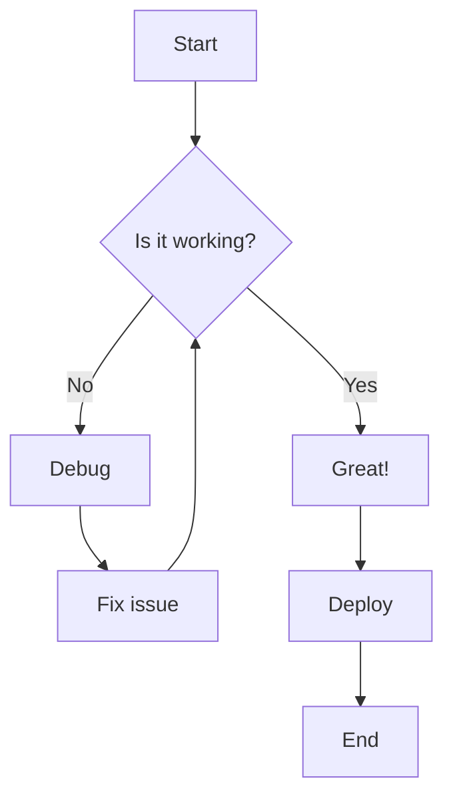
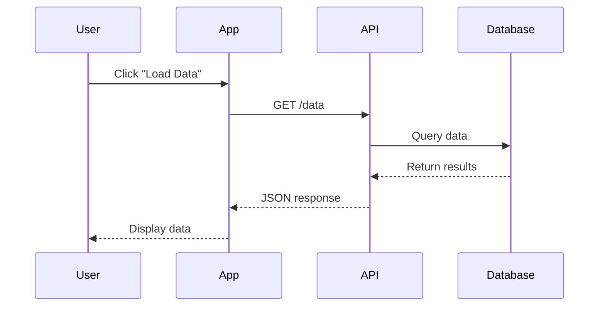
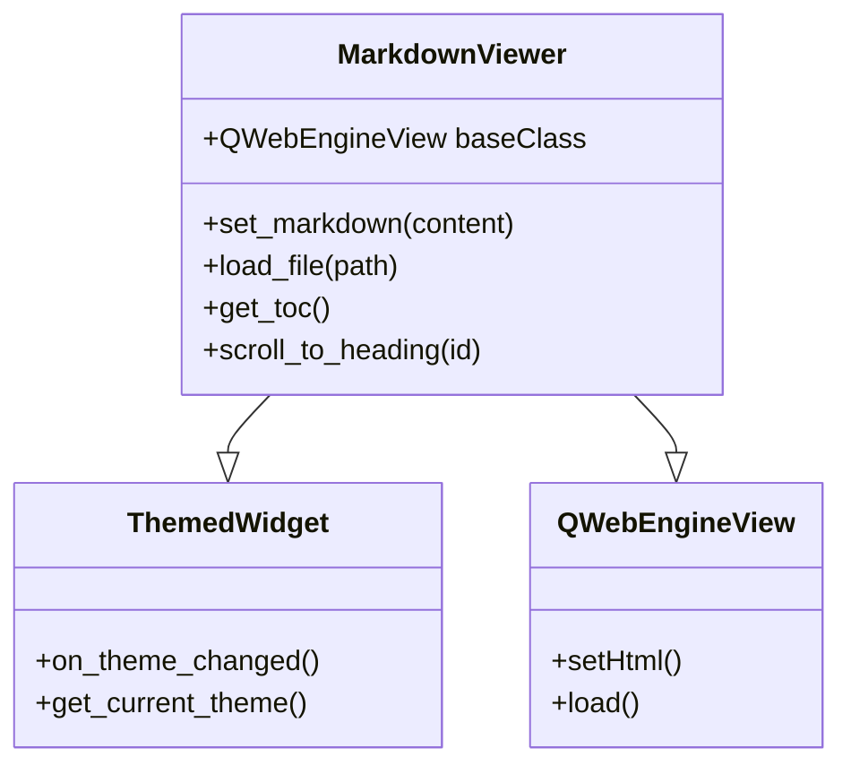
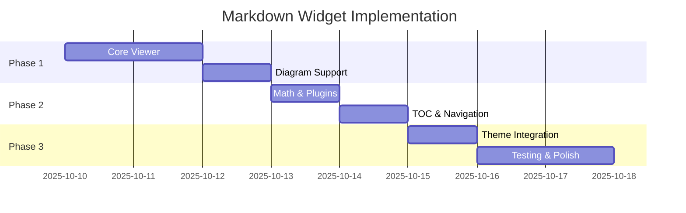
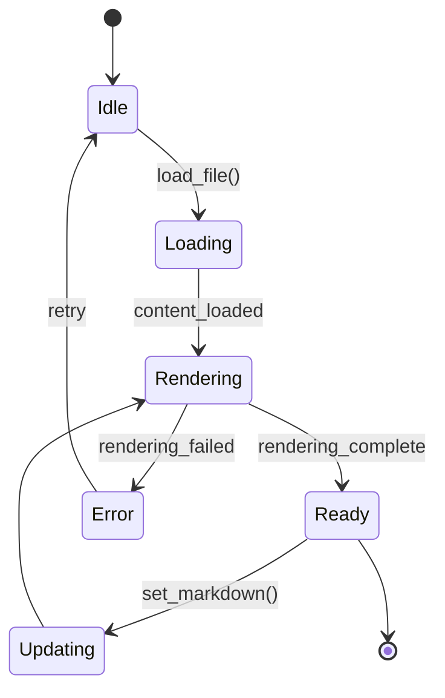

# VFWidgets Markdown Viewer - Feature Demonstration

Welcome to the **MarkdownViewer** widget demonstration! This document showcases all supported markdown features.

## Table of Contents

- [Basic Formatting](#basic-formatting)
- [Extended Syntax](#extended-syntax)
- [Code and Syntax Highlighting](#code-and-syntax-highlighting)
- [Mermaid Diagrams](#mermaid-diagrams)
- [Math Equations](#math-equations)
- [Tables](#tables)
- [Task Lists](#task-lists)
- [Advanced Features](#advanced-features)

---

## Basic Formatting

### Text Styling

You can use **bold text**, *italic text*, ***bold and italic***, ~~strikethrough~~, ++inserted++, and ==highlighted== text.

### Headings

# Heading 1
## Heading 2
### Heading 3
#### Heading 4
##### Heading 5
###### Heading 6

### Lists

**Unordered List:**
- Item 1
- Item 2
  - Nested item 2.1
  - Nested item 2.2
- Item 3

**Ordered List:**
1. First item
2. Second item
   1. Nested item 2.1
   2. Nested item 2.2
3. Third item

### Links and Images

[Visit VFWidgets GitHub](https://github.com/vilosource/vfwidgets)


### Blockquotes

> This is a blockquote.
>
> It can span multiple lines and paragraphs.
>
> > Nested blockquotes are also supported.

### Horizontal Rule

---

## Extended Syntax

### Footnotes

Here's a sentence with a footnote[^1].

You can use named footnotes[^note] as well.

[^1]: This is the first footnote.
[^note]: This is a named footnote with more detailed information.

### Abbreviations

The HTML specification is maintained by the W3C.

*[HTML]: Hyper Text Markup Language
*[W3C]: World Wide Web Consortium

### Definition Lists

Term 1
:   Definition 1a
:   Definition 1b

Term 2
:   Definition 2

### Subscript and Superscript

- Water molecule: H~2~O
- Einstein's equation: E = mc^2^
- Chemical formula: CO~2~

### Emoji Support

:rocket: :star: :heart: :smile: :tada: :bulb: :zap: :fire: :100:

Python is :snake:! JavaScript is awesome :sparkles:!

---

## Code and Syntax Highlighting

### Inline Code

Use the `print()` function to output text. Variables like `x = 10` are shown inline.

### Code Blocks

**Python:**
```python
def fibonacci(n):
    """Calculate fibonacci number recursively."""
    if n <= 1:
        return n
    return fibonacci(n-1) + fibonacci(n-2)

# Generate first 10 fibonacci numbers
for i in range(10):
    print(f"F({i}) = {fibonacci(i)}")
```

**JavaScript:**
```javascript
// Async function example
async function fetchData(url) {
    try {
        const response = await fetch(url);
        const data = await response.json();
        return data;
    } catch (error) {
        console.error('Error fetching data:', error);
        throw error;
    }
}
```

**Rust:**
```rust
// Pattern matching in Rust
fn describe_number(n: i32) -> &'static str {
    match n {
        0 => "zero",
        1..=10 => "small",
        11..=100 => "medium",
        _ => "large",
    }
}
```

**SQL:**
```sql
-- Complex query with JOIN
SELECT u.name, COUNT(o.id) as order_count
FROM users u
LEFT JOIN orders o ON u.id = o.user_id
WHERE u.active = true
GROUP BY u.id, u.name
HAVING COUNT(o.id) > 5
ORDER BY order_count DESC;
```

**Bash:**
```bash
#!/bin/bash
# Backup script with error handling
set -euo pipefail

backup_dir="/backup/$(date +%Y%m%d)"
mkdir -p "$backup_dir"

for file in /data/*.db; do
    echo "Backing up $file..."
    cp "$file" "$backup_dir/"
done

echo "Backup completed successfully!"
```

---

## Mermaid Diagrams

### Flowchart



### Sequence Diagram



### Class Diagram



### Gantt Chart



### State Diagram



---

## Math Equations

### Inline Math

The famous equation $E = mc^2$ relates energy and mass.

The quadratic formula is $x = \frac{-b \pm \sqrt{b^2-4ac}}{2a}$.

### Block Math

**Pythagorean Theorem:**

$$
a^2 + b^2 = c^2
$$

**Euler's Identity:**

$$
e^{i\pi} + 1 = 0
$$

**Integral:**

$$
\int_0^\infty e^{-x^2} dx = \frac{\sqrt{\pi}}{2}
$$

**Matrix:**

$$
\begin{bmatrix}
a & b & c \\
d & e & f \\
g & h & i
\end{bmatrix}
$$

**Summation:**

$$
\sum_{i=1}^{n} i = \frac{n(n+1)}{2}
$$

**Complex Equation:**

$$
\frac{\partial u}{\partial t} = \alpha \frac{\partial^2 u}{\partial x^2}
$$

---

## Tables

### Simple Table

| Feature | Supported | Notes |
|---------|-----------|-------|
| Markdown | ✅ | CommonMark + GFM |
| Mermaid | ✅ | All diagram types |
| Math | ✅ | KaTeX rendering |
| Syntax | ✅ | 300+ languages |
| Themes | ✅ | Light/Dark/Custom |

### Aligned Table

| Left Aligned | Center Aligned | Right Aligned |
|:-------------|:--------------:|--------------:|
| Row 1        | Data           | 100 |
| Row 2        | More Data      | 200 |
| Row 3        | Even More      | 300 |

### Complex Table

| Widget | Version | Status | Features |
|--------|---------|--------|----------|
| **MarkdownViewer** | 0.1.0 | 🚧 In Progress | Rendering, Mermaid, Math |
| **MarkdownEditor** | - | 📋 Planned | Editing, Live Preview |
| **MarkdownDiff** | - | 💡 Future | Diff View, Merge |

---

## Task Lists

### Project Tasks

- [x] Create widget structure
- [x] Plan architecture
- [x] Write documentation
- [ ] Implement viewer
  - [x] HTML template
  - [ ] JavaScript libraries
  - [ ] Python widget class
  - [ ] QWebChannel bridge
- [ ] Add theme support
- [ ] Write tests
- [ ] Create examples

### Features Checklist

- [x] Basic markdown rendering
- [x] Syntax highlighting (Prism.js)
- [x] Mermaid diagrams
- [x] Math equations (KaTeX)
- [x] Emoji support
- [x] Tables
- [ ] Image loading
- [ ] TOC extraction
- [ ] Export (HTML/PDF)

---

## Advanced Features

### Custom Containers

::: warning
**Warning:** This is a warning container!
:::

::: info
**Info:** Custom containers can be styled differently.
:::

::: danger
**Danger:** Be careful with this operation!
:::

### HTML Support

<div style="background: linear-gradient(to right, #667eea 0%, #764ba2 100%); padding: 20px; border-radius: 8px; color: white;">
  <h3>HTML is supported!</h3>
  <p>You can embed raw HTML in your markdown when needed.</p>
</div>

### Code with Line Numbers

```python {1,3-5}
# This line is highlighted
def process_data(data):
    # These lines are also highlighted
    result = []
    for item in data:
        result.append(item * 2)
    return result
```

---

## Performance Note

This document demonstrates **all major features** of the MarkdownViewer widget:

- ✅ 15+ heading sections
- ✅ Multiple code blocks (Python, JS, Rust, SQL, Bash)
- ✅ 5 Mermaid diagrams (flowchart, sequence, class, gantt, state)
- ✅ 6 math equations (inline and block)
- ✅ 3 tables with different alignments
- ✅ 20+ task list items
- ✅ Emoji, footnotes, subscript/superscript
- ✅ Images, links, blockquotes
- ✅ Custom containers and HTML

**Total size:** ~8KB of markdown demonstrating the full rendering capabilities!

---

**Generated with ❤️ by VFWidgets Markdown Collection**
