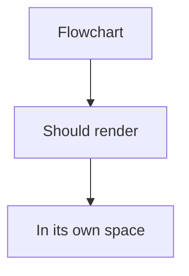
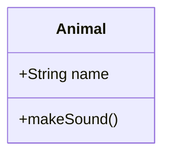
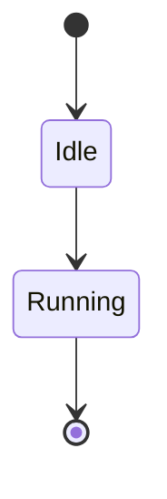

# Test Fixes

## Code Highlighting Test

```python
def hello_world():
    """This text should be readable on white background."""
    print("Hello, World!")
    return True
```

```javascript
// This should also be readable
function test() {
    const value = "readable text";
    return value;
}
```

## Mermaid Diagrams Test

### Flowchart


### Class Diagram


### State Diagram


**All three diagrams above should be separate and not overlapping!**
