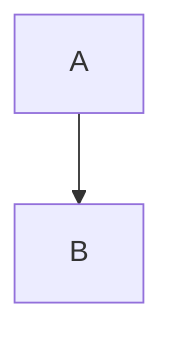

# Markdown Viewer Widget - Implementation Plan

**Status**: 🚧 Work in Progress
**Created**: 2025-10-10
**Widget**: `vfwidgets-markdown`
**Package**: `vfwidgets_markdown`

## Vision

A high-quality PySide6 markdown viewer widget that renders markdown using JavaScript libraries (markdown-it, Mermaid, Prism, KaTeX) in a QWebEngineView. The widget provides a clean API for displaying markdown while offering extensibility hooks for editor integration, TOC display, and custom navigation.

## Design Principles

1. **Single Responsibility**: Widget only displays rendered markdown - no editing, no TOC UI
2. **Data Over UI**: Provide data APIs (TOC, heading IDs, line ranges) for users to build their own UIs
3. **Offline First**: All JavaScript libraries bundled locally, no CDN dependencies
4. **Theme Aware**: Optional integration with vfwidgets-theme for consistent styling
5. **Editor Ready**: Hooks and signals for live preview and synchronization
6. **No Size Limits**: Handle documents of any size (let it crash if too big)

## JavaScript Library Stack

### Core Rendering
- **markdown-it** (~50KB) - Extensible markdown parser
  - Plugin system for extensions
  - High performance
  - Industry standard (VS Code, Facebook, Docusaurus)

### Diagram Support
- **Mermaid.js** (~200KB or ~100KB tiny version)
  - Flowcharts, sequence diagrams, Gantt charts
  - Class diagrams, state diagrams, ER diagrams
  - Mind maps, user journeys, Git graphs

### Syntax Highlighting
- **Prism.js** (~2KB core + ~0.3-0.5KB/language)
  - 300+ languages
  - Line numbers, line highlighting
  - Copy code button plugin
  - Multiple themes (VS Code Dark, VS Code Light, GitHub)

### Math Rendering
- **KaTeX** (~100KB)
  - Fastest math renderer
  - Synchronous rendering
  - Server-side rendering capable
  - `markdown-it-katex` plugin

### Plugins (Bundled)
All popular markdown-it plugins included:
- `markdown-it-anchor` - Heading IDs (essential for TOC)
- `markdown-it-emoji` - :smile: :rocket:
- `markdown-it-footnote` - Academic writing [^1]
- `markdown-it-mark` - ==highlighted text==
- `markdown-it-abbr` - Abbreviations
- `markdown-it-deflist` - Definition lists
- `markdown-it-checkbox` - Task lists [x] [ ]
- `markdown-it-sub` - H~2~O subscript
- `markdown-it-sup` - X^2^ superscript
- `markdown-it-ins` - ++inserted++ text
- `markdown-it-container` - Custom blocks (notes, warnings)

**Total Bundle Size**: ~365KB (acceptable for desktop app)

## Architecture

### Python Layer (Qt/PySide6)

```
src/vfwidgets_markdown/
├── __init__.py           # Public API exports
├── viewer.py             # MarkdownViewer widget (main class)
├── constants.py          # Constants and configuration
├── utils.py              # Utility functions
└── resources/
    ├── viewer.html       # HTML template
    ├── js/
    │   ├── markdown-it.min.js
    │   ├── markdown-it-plugins.min.js (all plugins bundled)
    │   ├── mermaid.min.js
    │   ├── prism.min.js
    │   ├── katex.min.js
    │   └── viewer.js     # Custom viewer logic
    └── css/
        ├── viewer.css           # Base styles
        ├── github-markdown.css  # GitHub-style markdown
        ├── katex.min.css
        └── prism-themes/
            ├── prism-vscode-dark.css
            ├── prism-vscode-light.css
            └── prism-github.css
```

### JavaScript Layer (WebView)

**viewer.js responsibilities:**
- Initialize markdown-it with plugins
- Initialize Mermaid, Prism, KaTeX
- Render markdown to HTML
- Extract TOC structure
- Handle theme switching
- Communicate with Qt via Qt WebChannel

**Qt ↔ JavaScript Bridge:**
```python
# Python → JavaScript
page.runJavaScript("setMarkdown(content)")
page.runJavaScript("setTheme('dark')")

# JavaScript → Python (via QWebChannel)
viewer.content_loaded.emit()
viewer.toc_changed.emit(toc_data)
```

## Implementation Phases

### Phase 1: Core Viewer (Days 1-2)
**Goal**: Basic markdown rendering with markdown-it

**Tasks:**
1. Create `MarkdownViewer` class extending `QWebEngineView`
2. Create `viewer.html` template with markdown-it
3. Implement resource loading (HTML, CSS, JS from package)
4. Implement `set_markdown(content: str)` method
5. Implement Qt ↔ JavaScript bridge setup
6. Create basic example

**Deliverables:**
- Working viewer that renders markdown
- Basic example showing simple markdown rendering
- Unit tests for basic rendering

**Test:**
```python
viewer = MarkdownViewer()
viewer.set_markdown("# Hello\n\nThis is **markdown**!")
# Should render: <h1>Hello</h1><p>This is <strong>markdown</strong>!</p>
```

### Phase 2: Diagram & Syntax Support (Days 2-3)
**Goal**: Add Mermaid diagrams and Prism syntax highlighting

**Tasks:**
1. Integrate Mermaid.js into viewer.html
2. Add mermaid code block detection
3. Integrate Prism.js with markdown-it
4. Add auto-language detection for code blocks
5. Bundle multiple Prism themes
6. Implement `set_syntax_theme(theme: str)` method

**Deliverables:**
- Mermaid diagrams render correctly
- Code blocks have syntax highlighting
- Theme switching for syntax highlighting
- Examples with diagrams and code

**Test:**
```python
viewer.set_markdown(\"\"\"


```python
def hello():
    print("Hello, World!")
```
\"\"\")
# Should render diagram and highlighted code
```

### Phase 3: Math & Plugins (Day 3)
**Goal**: Add KaTeX math rendering and all markdown-it plugins

**Tasks:**
1. Integrate KaTeX with markdown-it-katex plugin
2. Bundle all popular markdown-it plugins
3. Enable plugins in markdown-it configuration
4. Test all plugin features
5. Create comprehensive example

**Deliverables:**
- Math equations render correctly (inline and block)
- All plugins working (emoji, footnotes, task lists, etc.)
- Examples demonstrating all features

**Test:**
```python
viewer.set_markdown(\"\"\"
Inline math: $E=mc^2$

Block math:
$$
\\int_0^\\infty e^{-x^2} dx = \\frac{\\sqrt{\\pi}}{2}
$$

- [x] Task complete
- [ ] Task pending

:rocket: Emoji support
\"\"\")
```

### Phase 4: TOC & Navigation API (Day 4)
**Goal**: Expose TOC as data and implement scroll API

**Tasks:**
1. Extract heading structure from rendered markdown
2. Implement `get_toc()` → returns list of heading dicts
3. Implement `scroll_to_heading(id: str)` method
4. Implement `scroll_to_line(line: int)` method
5. Add `toc_changed` signal
6. Create TOC example (sidebar with tree view)

**Deliverables:**
- TOC data extraction working
- Programmatic scrolling working
- Signal emitted on TOC change
- Example showing custom TOC sidebar

**Test:**
```python
viewer.set_markdown("# Intro\\n## Section 1\\n## Section 2")
toc = viewer.get_toc()
# Returns: [
#   {"level": 1, "text": "Intro", "id": "intro", "line": 0},
#   {"level": 2, "text": "Section 1", "id": "section-1", "line": 1},
#   ...
# ]
viewer.scroll_to_heading("section-1")
```

### Phase 5: Image Support (Day 4-5)
**Goal**: Support all image types (base64, local, URLs)

**Tasks:**
1. Implement base64 embedded image support
2. Implement `set_base_path(path: str)` for relative images
3. Implement `set_image_resolver(callback)` for custom resolution
4. Handle HTTP/HTTPS image URLs
5. Test with various image formats

**Deliverables:**
- All image types working
- Custom image resolver working
- Examples with images

**Test:**
```python
viewer.set_base_path("/home/user/docs")
viewer.set_markdown("")  # Resolved relative to base_path
viewer.set_markdown("")  # Base64 works
```

### Phase 6: Theme Integration (Day 5)
**Goal**: ThemedWidget integration with vfwidgets-theme

**Tasks:**
1. Make MarkdownViewer extend ThemedWidget (optional)
2. Implement `on_theme_changed()` callback
3. Auto-select matching Prism theme (dark/light)
4. Inject theme colors into viewer CSS
5. Add `set_theme(theme: str)` method
6. Add `inject_css(css: str)` method

**Deliverables:**
- Theme switching working
- Automatic dark/light detection
- Custom CSS injection
- Themed example

**Test:**
```python
# With vfwidgets-theme installed
viewer.set_theme("dark")  # Auto-selects prism-vscode-dark
viewer.set_theme("light")  # Auto-selects prism-vscode-light
viewer.inject_css(".custom { color: red; }")
```

### Phase 7: Editor Integration Hooks (Day 6)
**Goal**: Signals and API for editor coupling

**Tasks:**
1. Implement `enable_sync_mode()` - preserves scroll on update
2. Implement `set_debounce_delay(ms)` for live preview
3. Add `scroll_position_changed` signal
4. Add `heading_clicked` signal
5. Add `link_clicked` signal
6. Create live editor example

**Deliverables:**
- Sync mode working (scroll preservation)
- All signals firing correctly
- Debouncing working
- Live preview example (QPlainTextEdit + MarkdownViewer)

**Test:**
```python
viewer.enable_sync_mode()
viewer.set_debounce_delay(300)  # 300ms

viewer.heading_clicked.connect(lambda id: print(f"Clicked: {id}"))
viewer.scroll_position_changed.connect(lambda pct: print(f"Scrolled: {pct}%"))
```

### Phase 8: Keyboard Shortcuts (Day 6)
**Goal**: Built-in shortcuts and KeybindingManager integration

**Tasks:**
1. Implement `enable_shortcuts()` method
2. Add built-in shortcuts (find, zoom, scroll)
3. Document KeybindingManager integration pattern
4. Create example with custom shortcuts

**Deliverables:**
- Built-in shortcuts working (opt-in)
- KeybindingManager example
- Documentation

**Test:**
```python
viewer.enable_shortcuts()
# Ctrl+F for find, Ctrl++/- for zoom, Home/End for scroll
```

### Phase 9: Export Functionality (Day 7)
**Goal**: Export rendered markdown to various formats

**Tasks:**
1. Implement `export_html()` method
2. Implement `export_pdf(path)` using QWebEnginePage
3. Implement `export_to_file(path, format)` dispatcher
4. Add export example

**Deliverables:**
- HTML export working
- PDF export working
- Examples

**Test:**
```python
html = viewer.export_html()  # Returns rendered HTML string
viewer.export_pdf("output.pdf")  # Generates PDF
```

### Phase 10: Documentation & Examples (Day 7-8)
**Goal**: Complete documentation and examples

**Tasks:**
1. Write comprehensive API documentation (docs/API.md)
2. Write architecture documentation (docs/ARCHITECTURE.md)
3. Update README.md with features and examples
4. Create all examples:
   - 01_basic_viewer.py
   - 02_live_preview.py (editor + viewer)
   - 03_toc_sidebar.py (custom TOC)
   - 04_themed_viewer.py (theme integration)
   - 05_image_support.py (image handling)
   - 06_export.py (export to HTML/PDF)
5. Write comprehensive tests
6. Performance testing

**Deliverables:**
- Complete documentation
- 6+ working examples
- >80% test coverage
- Performance benchmarks

## Public API Summary

```python
class MarkdownViewer(QWebEngineView):
    \"\"\"PySide6 markdown viewer widget.\"\"\"

    # Signals
    content_loaded = Signal()
    toc_changed = Signal(list)  # List of heading dicts
    heading_clicked = Signal(str)  # Heading ID
    link_clicked = Signal(str)  # URL
    scroll_position_changed = Signal(float)  # Percentage 0.0-1.0
    rendering_failed = Signal(str)  # Error message

    # Content methods
    def set_markdown(self, content: str) -> None: ...
    def load_file(self, path: str) -> None: ...

    # TOC and navigation
    def get_toc(self) -> list[dict]: ...
    def scroll_to_heading(self, heading_id: str) -> None: ...
    def scroll_to_line(self, line: int) -> None: ...
    def scroll_to_percentage(self, pct: float) -> None: ...

    # Image handling
    def set_base_path(self, path: str) -> None: ...
    def set_image_resolver(self, callback: Callable[[str], str]) -> None: ...

    # Theme and styling
    def set_theme(self, theme: str) -> None: ...  # "dark", "light", "custom"
    def set_syntax_theme(self, theme: str) -> None: ...  # Prism theme
    def inject_css(self, css: str) -> None: ...

    # Editor integration
    def enable_sync_mode(self) -> None: ...
    def set_debounce_delay(self, ms: int) -> None: ...

    # Keyboard shortcuts
    def enable_shortcuts(self) -> None: ...

    # Export
    def export_html(self) -> str: ...
    def export_pdf(self, path: str) -> None: ...
    def export_to_file(self, path: str, format: str) -> None: ...
```

## Testing Strategy

### Unit Tests
- Test markdown rendering correctness
- Test each plugin feature
- Test TOC extraction
- Test scroll methods
- Test signal emissions

### Integration Tests
- Test theme switching
- Test image loading
- Test export functionality
- Test editor sync

### Manual Tests
- Test with large documents (>1MB)
- Test mermaid diagram rendering
- Test math equation rendering
- Test all markdown-it plugins
- Test in different themes

## Performance Targets

- Initial render: <200ms for 10KB document
- Update (debounced): <100ms for 10KB document
- TOC extraction: <50ms
- Theme switch: <100ms
- Scroll to heading: <50ms

## Future Enhancements (Out of Scope)

These are **not** included in the initial implementation but could be added later:

1. Search functionality (find in document)
2. Print support
3. Custom markdown-it plugin registration API
4. Diagram export (save mermaid as PNG)
5. Code execution (run code blocks)
6. Collaborative editing hooks
7. Diff view (markdown comparison)
8. Offline mode indicator

## Success Criteria

✅ Widget renders markdown correctly using markdown-it
✅ Mermaid diagrams render
✅ Syntax highlighting works (Prism)
✅ Math equations render (KaTeX)
✅ All bundled plugins working
✅ TOC data extraction working
✅ Image support (all types)
✅ Theme integration (optional)
✅ Editor hooks and signals
✅ Export to HTML and PDF
✅ Comprehensive documentation
✅ 6+ working examples
✅ >80% test coverage

## Timeline

**Total Estimated Time**: 7-8 days

- Days 1-2: Core viewer + diagrams + syntax highlighting
- Days 3-4: Math + plugins + TOC API
- Days 4-5: Images + theme integration
- Day 6: Editor hooks + keyboard shortcuts
- Day 7: Export functionality
- Day 7-8: Documentation + examples + testing

## Notes

- All JavaScript libraries must be bundled locally (no CDN)
- Widget should work without internet connection
- Optional dependencies (theme, keybinding) should not break core functionality
- Follow VFWidgets patterns (signals, ThemedWidget mixin, examples)
- Documentation is as important as code
