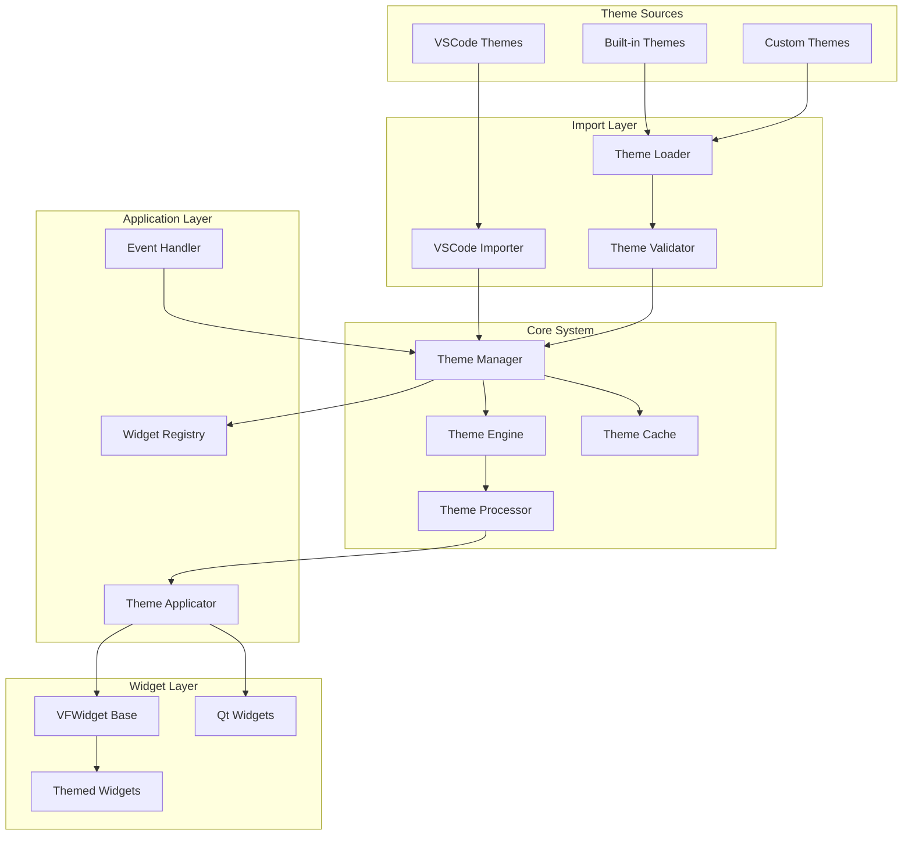

# VFWidgets Theme System - Architecture Design

## Table of Contents
1. [Overview](#overview)
2. [Design Principles](#design-principles)
3. [System Architecture](#system-architecture)
4. [Core Components](#core-components)
5. [Data Flow](#data-flow)
6. [Integration Layers](#integration-layers)
7. [Performance Architecture](#performance-architecture)
8. [Security Considerations](#security-considerations)

## Overview

The VFWidgets Theme System is a comprehensive theming solution that provides:
- Universal theming across all VFWidgets and PySide6 applications
- VSCode theme compatibility for leveraging existing theme ecosystem
- Runtime theme switching without application restart
- Progressive enhancement from zero-config to full customization
- Type-safe theme property access with IDE support

## Design Principles

### 1. Clean Architecture as THE Way
We provide a **single, correct approach** that is both easy to use and architecturally sound:
- **Simple API**: `class MyWidget(ThemedWidget)` - that's it!
- **Clean Inside**: Proper dependency injection, memory management, thread safety
- **No Compromises**: Easy doesn't mean wrong - we hide complexity, not ignore it

### 2. Progressive Enhancement
```
ThemedWidget (Start Here - Already Clean!)
    ↓
Add theme_config for custom properties
    ↓
Override on_theme_changed() for dynamic behavior
    ↓
Access full architecture when needed
```

### 3. Convention Over Configuration
- Widgets named `*Button` automatically get button theme properties
- Standard Qt widgets automatically mapped to theme properties
- Sensible defaults that "just work"
- Clean architecture by default, not opt-in

### 4. Separation of Concerns with Dependency Injection
```
Protocols/Interfaces     Implementation          Widget Layer
        ↓                       ↓                      ↓
ThemeProvider ←→  ThemeRepository, Applicator ←→  ThemedWidget
        ↑                       ↑                      ↑
  Testable              Single Responsibility      Simple API
```

### 5. Performance and Safety First
- Lazy loading with memory safety (WeakRefs)
- Multi-level caching with proper invalidation
- Batch updates with thread safety
- Property change detection with cleanup protocols

## System Architecture



## Core Components

### 1. Theme Data Model

```python
@dataclass
class Theme:
    """Core theme data structure"""
    # Metadata
    name: str
    type: Literal["dark", "light"]
    version: str
    extends: Optional[str]  # Parent theme for inheritance

    # Core properties
    colors: Dict[str, Color]
    tokenColors: List[TokenColor]  # Syntax highlighting

    # Platform-specific
    qt: Dict[str, Any]  # Qt-specific overrides

    # Computed properties
    _generated: Dict[str, Color]  # Auto-generated colors
    _cache: Dict[str, str]  # Cached QSS strings
```

### 2. ThemedWidget - The Simple API

```python
class ThemedWidget(metaclass=ThemedWidgetMeta):
    """
    The main way to create themed widgets. Mixin for multiple inheritance.

    What developers see: Simple mixin
    What happens inside: Clean architecture with DI, memory safety, thread safety

    Usage:
        class MyWidget(ThemedWidget, QWidget):
            pass

    Or use convenience classes:
        class MyWidget(ThemedQWidget):  # Single inheritance
            pass
    """

    # Optional configuration for custom properties
    theme_config = {}

    def __init__(self, parent=None, **kwargs):
        super().__init__(parent=parent, **kwargs)
        # Internally uses dependency injection, but hidden from user
        self._setup_theming()

    def on_theme_changed(self):
        """Override this to react to theme changes"""
        pass
```

### 3. Clean Architecture Components (Hidden from Users)

```python
# These are internal - users don't see this complexity

class ThemeProvider(Protocol):
    """Interface for theme provision - enables testing and DI"""
    def get_current_theme(self) -> Theme: ...
    def get_property(self, key: str) -> Any: ...
    def subscribe(self, widget: ThemedWidget) -> None: ...
    def unsubscribe(self, widget: ThemedWidget) -> None: ...

class ThemeRepository:
    """Manages theme storage and retrieval (SRP)"""
    def load_theme(self, path: Path) -> Theme
    def save_theme(self, theme: Theme, path: Path)
    def get_theme(self, name: str) -> Theme

class ThemeApplicator:
    """Applies themes to widgets (SRP)"""
    def apply_theme(self, theme: Theme, widget: QWidget)
    def generate_qss(self, theme: Theme, widget_type: Type) -> str

class WidgetRegistry:
    """Manages widget lifecycle with WeakRefs"""
    def __init__(self):
        self._widgets: weakref.WeakSet[ThemedWidget] = weakref.WeakSet()

    def register(self, widget: ThemedWidget):
        self._widgets.add(widget)  # Automatic cleanup!
```

### 3. Theme Engine

```python
class ThemeEngine:
    """Core theme processing and application"""

    def __init__(self):
        self._processor: ThemeProcessor
        self._generator: QSSGenerator
        self._applicator: ThemeApplicator

    # Core operations
    def process_theme(theme: Theme) -> ProcessedTheme
    def generate_qss(theme: Theme, target: QWidget) -> str
    def apply_theme(theme: Theme, widget: QWidget)

    # Advanced features
    def interpolate_colors(theme: Theme)
    def resolve_inheritance(theme: Theme)
    def validate_properties(theme: Theme) -> List[ValidationError]
```

### 4. Memory Management & Lifecycle

```python
class CleanupProtocol:
    """Ensures proper cleanup of widgets"""

    def __init__(self, widget: ThemedWidget):
        self._widget_ref = weakref.ref(widget)
        self._finalizer = weakref.finalize(widget, self._cleanup)

    def _cleanup(self):
        """Called automatically when widget is garbage collected"""
        # Unsubscribe from theme updates
        # Clear caches
        # Release resources

class ThemedWidget(metaclass=ThemedWidgetMeta):
    """Actual implementation showing memory safety (mixin pattern)"""

    def __init__(self, parent=None, **kwargs):
        super().__init__(parent=parent, **kwargs)
        self._cleanup = CleanupProtocol(self)
        self._theme_provider = ThemeProvider.default()  # DI
        self._theme_provider.subscribe(self)  # Weak reference

    def closeEvent(self, event):
        """Proper cleanup on window close"""
        self._cleanup.cleanup()
        super().closeEvent(event)

# Convenience class for single inheritance
class ThemedQWidget(ThemedWidget, QWidget):
    """Single inheritance convenience class"""
    pass
```

### 5. Property System

```python
class ThemeProperty:
    """Descriptor for theme properties"""

    def __init__(self, key: str, default: Any = None,
                 computed: bool = False, context_aware: bool = False):
        self.key = key
        self.default = default
        self.computed = computed
        self.context_aware = context_aware

    def __get__(self, obj, type=None):
        if self.computed:
            return self._compute(obj)
        if self.context_aware:
            key = f"{obj.theme_context}.{self.key}"
        else:
            key = self.key
        return obj.get_theme_property(key, self.default)
```

## Data Flow

### Theme Loading Flow
```
1. User requests theme load
2. ThemeLoader reads JSON file
3. ThemeValidator validates structure
4. ThemeProcessor resolves inheritance
5. ColorInterpolator generates missing colors
6. Theme added to ThemeManager registry
7. Theme cached for performance
```

### Theme Application Flow
```
1. User switches theme
2. ThemeManager notifies WidgetRegistry
3. For each registered widget:
   a. ThemeEngine generates QSS
   b. Check cache for existing QSS
   c. Apply QSS to widget
   d. Call widget.on_theme_changed()
4. Update application palette
5. Emit theme_changed signal
```

### Property Resolution Flow
```
1. Widget requests property (e.g., "button.background")
2. Check widget-specific overrides
3. Check theme colors dictionary
4. Check generated colors
5. Check parent theme (if extends)
6. Apply context modifiers (hover, pressed, etc.)
7. Return color or default
```

## Integration Layers

### VSCode Theme Compatibility

```python
class VSCodeThemeImporter:
    """Import VSCode themes with property mapping"""

    # Property mapping
    PROPERTY_MAP = {
        "editor.background": "window.background",
        "editor.foreground": "window.foreground",
        "activityBar.background": "sidebar.background",
        "button.background": "button.background",
        # ... extensive mapping
    }

    def import_theme(vscode_json: dict) -> Theme:
        # Map VSCode properties to Qt properties
        # Generate missing Qt-specific properties
        # Convert color formats
        # Handle token colors for syntax
```

### Qt/QSS Generation

```python
class QSSGenerator:
    """Generate Qt Style Sheets from themes"""

    def generate(theme: Theme, widget: QWidget) -> str:
        # Build selector hierarchy
        # Apply property mappings
        # Handle pseudo-states (:hover, :pressed)
        # Generate gradients and effects
        # Optimize output size
```

### Platform Integration

```python
class PlatformThemeAdapter:
    """Adapt to platform-specific theming"""

    def sync_with_system(self):
        # Detect system dark/light mode
        # Listen for system theme changes
        # Apply platform-specific adjustments
        # Handle high contrast modes
```

## Thread Safety Architecture

### Thread-Safe Singleton

```python
class ThemeSystem:
    """Thread-safe singleton using double-checked locking"""
    _instance = None
    _lock = threading.Lock()

    def __new__(cls):
        if cls._instance is None:
            with cls._lock:
                if cls._instance is None:
                    cls._instance = super().__new__(cls)
                    cls._instance._initialize()
        return cls._instance

    def _initialize(self):
        self._theme_provider = ThemeProvider()
        self._qt_signal = ThemeChangedSignal()  # Use Qt signals for thread safety
```

### Qt Signal/Slot Integration

```python
class ThemeChangedSignal(QObject):
    """Thread-safe theme change notifications using Qt signals"""
    theme_changed = Signal(Theme, Theme)  # old, new

    def emit_change(self, old_theme: Theme, new_theme: Theme):
        # Qt handles thread marshalling automatically
        self.theme_changed.emit(old_theme, new_theme)
```

## Performance Architecture

### Caching Strategy

```python
class ThemeCache:
    """Multi-level caching system"""

    # L1 Cache: Property values
    _property_cache: Dict[str, Any]  # Fast property lookup

    # L2 Cache: Generated QSS
    _qss_cache: Dict[Tuple[Theme, Type], str]  # Per widget-type QSS

    # L3 Cache: Compiled themes
    _compiled_cache: Dict[str, CompiledTheme]  # Pre-processed themes
```

### Lazy Loading

```python
class LazyThemeLoader:
    """Load themes on-demand"""

    def __init__(self):
        self._theme_manifest: Dict[str, ThemeMetadata]
        self._loaded_themes: Dict[str, Theme] = {}

    def get_theme(name: str) -> Theme:
        if name not in self._loaded_themes:
            self._loaded_themes[name] = self._load_theme(name)
        return self._loaded_themes[name]
```

### Batch Updates

```python
class BatchThemeApplicator:
    """Apply themes efficiently to multiple widgets"""

    def apply_batch(theme: Theme, widgets: List[QWidget]):
        # Group widgets by type
        # Generate QSS once per type
        # Apply in single pass
        # Minimize repaints
```

## Security Considerations

### Theme Validation

```python
class ThemeValidator:
    """Validate themes for security and correctness"""

    def validate(theme_json: dict) -> ValidationResult:
        # Check for malicious patterns
        # Validate color formats
        # Ensure property safety
        # Verify file references
        # Check size limits
```

### Sandboxed Execution

```python
class ThemeSandbox:
    """Execute theme code in sandbox"""

    def evaluate_computed_property(code: str, context: dict) -> Any:
        # Restricted execution environment
        # No file system access
        # No network access
        # Limited built-ins
        # Timeout protection
```

## Extension Points

### Custom Property Providers

```python
class PropertyProvider(ABC):
    """Extension point for custom properties"""

    @abstractmethod
    def get_property(self, key: str, theme: Theme) -> Any:
        pass

    @abstractmethod
    def can_provide(self, key: str) -> bool:
        pass
```

### Theme Transformers

```python
class ThemeTransformer(ABC):
    """Transform themes during loading"""

    @abstractmethod
    def transform(self, theme: Theme) -> Theme:
        pass
```

### Widget Adapters

```python
class WidgetAdapter(ABC):
    """Adapt third-party widgets for theming"""

    @abstractmethod
    def apply_theme(self, widget: QWidget, theme: Theme):
        pass
```

## Error Handling

### Graceful Degradation

```python
class ThemeFallbackChain:
    """Fallback chain for theme resolution"""

    chain = [
        RequestedTheme,
        SystemTheme,
        DefaultTheme,
        MinimalTheme,  # Guaranteed to work
    ]
```

### Error Recovery

```python
class ThemeErrorHandler:
    """Handle theme errors gracefully"""

    def handle_missing_property(key: str) -> Any:
        # Log warning
        # Return sensible default
        # Notify developer in debug mode

    def handle_invalid_theme(theme: str) -> Theme:
        # Log error
        # Fall back to default theme
        # Show user notification
```

## Testing Architecture

### Theme Testing Framework

```python
class ThemeTestCase:
    """Base class for theme tests"""

    def setup_theme_test(self):
        # Create isolated theme manager
        # Mock system settings
        # Setup test themes

    def assert_theme_applied(widget: QWidget, theme: Theme):
        # Verify QSS application
        # Check property resolution
        # Validate visual state
```

### Property Coverage

```python
class ThemePropertyCoverage:
    """Ensure all properties are themed"""

    def analyze_widget(widget_class: Type) -> CoverageReport:
        # Find all color properties
        # Check theme mapping
        # Report unmapped properties
```

## Future Extensibility

### Planned Features

1. **Theme Marketplace**: Download and share themes
2. **AI Theme Generation**: Generate themes from images/descriptions
3. **Animation Support**: Animated theme transitions
4. **Component Library**: Pre-themed complex components
5. **Theme Inheritance Chain**: Multiple inheritance levels
6. **Conditional Themes**: Time/context-based theme switching
7. **Theme Composition**: Combine multiple partial themes
8. **Remote Themes**: Load themes from URLs

### Plugin Architecture

```python
class ThemePlugin(ABC):
    """Plugin interface for theme extensions"""

    @abstractmethod
    def initialize(self, manager: ThemeManager):
        pass

    @abstractmethod
    def get_capabilities(self) -> List[str]:
        pass
```

## Conclusion

The VFWidgets Theme System architecture provides:
- **Flexibility** through progressive enhancement
- **Performance** via intelligent caching
- **Compatibility** with VSCode themes
- **Extensibility** through plugin architecture
- **Safety** with validation and sandboxing
- **Developer Experience** with zero-config defaults

This architecture ensures themes are easy to use, powerful when needed, and maintainable long-term.