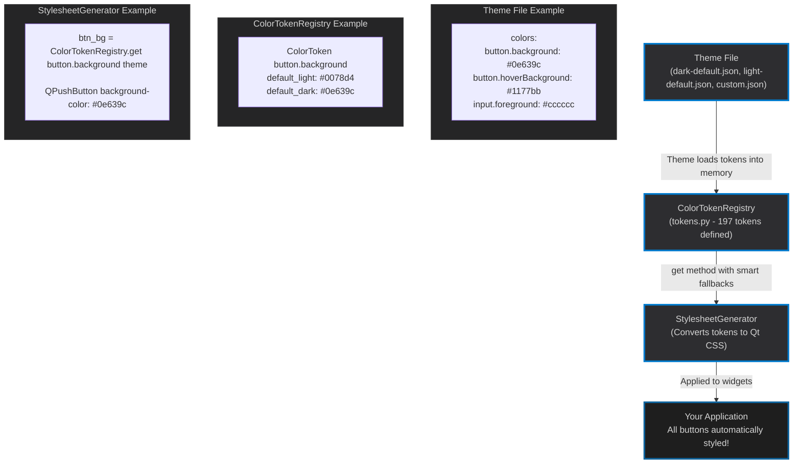
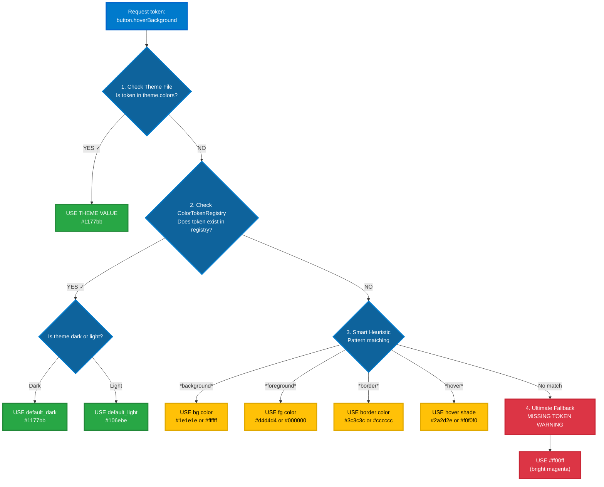

# Theme Tokens System - Complete Guide

## 🎯 What Are Tokens?

**Tokens** are named variables that define the visual appearance of your application. Instead of hardcoding colors like `#007acc` everywhere, you use semantic names like `button.background`.

Think of tokens as a **design language** - they create consistency and make themes reusable.

---

## 📊 Token Architecture Overview



---

## 🏗️ Token Structure

### Token Naming Convention

Tokens use a **hierarchical dot notation**:

```
<category>.<element>.<state>.<property>
```

**Examples:**
- `button.background` - Button background color (default state)
- `button.hoverBackground` - Button background when hovering
- `button.danger.background` - Danger variant button background
- `input.focusBorder` - Input field border when focused
- `list.selectedBackground` - List item background when selected

### Token Hierarchy

```mermaid
graph TD
    Root["Token Categories<br/>(197 tokens total)"]

    Root --> Colors["colors.*<br/>(10 tokens)"]
    Root --> Button["button.*<br/>(15 tokens)"]
    Root --> Input["input.*<br/>(18 tokens)"]
    Root --> List["list.*<br/>(22 tokens)"]
    Root --> Editor["editor.*<br/>(35+ tokens)"]
    Root --> Tab["tab.*<br/>(20 tokens)"]
    Root --> Menu["menu.*<br/>(15 tokens)"]
    Root --> Scrollbar["scrollbar.*<br/>(8 tokens)"]
    Root --> Terminal["terminal.*<br/>(16 ANSI colors)"]

    Colors --> C1["colors.foreground"]
    Colors --> C2["colors.background"]
    Colors --> C3["colors.focusBorder"]
    Colors --> C4["colors.primary"]

    Button --> B1["button.background"]
    Button --> B2["button.hoverBackground"]
    Button --> B3["button.pressedBackground"]
    Button --> B4["button.secondary.*"]
    Button --> B5["button.danger.*"]
    Button --> B6["button.success.*"]
    Button --> B7["button.warning.*"]

    Input --> I1["input.background"]
    Input --> I2["input.foreground"]
    Input --> I3["input.border"]
    Input --> I4["input.focusBorder"]
    Input --> I5["input.selectionBackground"]

    List --> L1["list.background"]
    List --> L2["list.hoverBackground"]
    List --> L3["list.selectedBackground"]

    style Root fill:#007acc,stroke:#0066cc,stroke-width:4px,color:#fff
    style Colors fill:#0e639c,stroke:#007acc,stroke-width:3px,color:#fff
    style Button fill:#0e639c,stroke:#007acc,stroke-width:3px,color:#fff
    style Input fill:#0e639c,stroke:#007acc,stroke-width:3px,color:#fff
    style List fill:#0e639c,stroke:#007acc,stroke-width:3px,color:#fff
    style Editor fill:#0e639c,stroke:#007acc,stroke-width:3px,color:#fff
    style Tab fill:#0e639c,stroke:#007acc,stroke-width:3px,color:#fff
    style Menu fill:#0e639c,stroke:#007acc,stroke-width:3px,color:#fff
    style Scrollbar fill:#0e639c,stroke:#007acc,stroke-width:3px,color:#fff
    style Terminal fill:#0e639c,stroke:#007acc,stroke-width:3px,color:#fff
```



---

## 🔍 How Token Resolution Works

When you request a token like `button.hoverBackground`, the system follows this **fallback chain**:

### Resolution Flow



### Code Example

```python
# From tokens.py line 1535
@classmethod
def get(cls, token: str, theme: "Theme") -> str:
    """Get token value with smart fallbacks."""

    # Step 1: Check theme
    if token in theme.colors:
        return theme.colors[token]

    # Step 2: Check registry defaults
    token_def = cls.get_token(token)
    if token_def:
        is_dark = cls._is_dark_theme(theme)
        return token_def.default_dark if is_dark else token_def.default_light

    # Step 3: Smart heuristic
    return cls._get_smart_default(token, theme)
```

---

## 📝 Token Categories (14 Total)

### 1. Base Colors (10 tokens)
Foundation colors used across all widgets.

```json
{
  "colors.foreground": "#d4d4d4",       // Text color
  "colors.background": "#1e1e1e",       // Background color
  "colors.focusBorder": "#007acc",      // Focus outline
  "colors.primary": "#007acc",          // Brand accent
  "colors.errorForeground": "#f48771",  // Error text
  "colors.warningForeground": "#cca700" // Warning text
}
```

### 2. Button Colors (15 tokens)
All button states and variants.

```json
{
  // Default button
  "button.background": "#0e639c",
  "button.foreground": "#ffffff",
  "button.hoverBackground": "#1177bb",
  "button.pressedBackground": "#094771",
  "button.disabledBackground": "#555555",

  // Button variants
  "button.secondary.background": "#313131",
  "button.danger.background": "#dc3545",
  "button.success.background": "#28a745",
  "button.warning.background": "#ffc107"
}
```

### 3. Input Colors (18 tokens)
Text inputs, text areas, dropdowns.

```json
{
  "input.background": "#3c3c3c",
  "input.foreground": "#cccccc",
  "input.border": "#555555",
  "input.focusBorder": "#0066cc",
  "input.selectionBackground": "#264f78",
  "input.placeholderForeground": "#999999"
}
```

### 4. List/Tree Colors (22 tokens)
List views, tree views, tables.

```json
{
  "list.background": "#1e1e1e",
  "list.foreground": "#d4d4d4",
  "list.hoverBackground": "#2a2d2e",
  "list.selectedBackground": "#094771",
  "list.selectedForeground": "#ffffff",
  "list.inactiveSelectedBackground": "#37373d"
}
```

### 5. Editor Colors (35+ tokens)
Code editor specific colors.

```json
{
  "editor.background": "#1a1a1a",
  "editor.foreground": "#d4d4d4",
  "editor.lineHighlightBackground": "#282828",
  "editor.selectionBackground": "#264f78",
  "editor.cursorForeground": "#aeafad",
  "editor.findMatchBackground": "#515c6a"
}
```

### 6. Tab Colors (20 tokens)
Tab widgets (QTabWidget, QTabBar).

```json
{
  "tab.activeBackground": "#1e1e1e",
  "tab.inactiveBackground": "#2d2d30",
  "tab.activeForeground": "#ffffff",
  "tab.inactiveForeground": "#969696",
  "tab.border": "#252526",
  "tab.activeBorder": "#0066cc",
  "tab.hoverBackground": "#2e2e32"
}
```

### 7. Menu Colors (15 tokens)
Menu bars and context menus.

```json
{
  "menu.background": "#252526",
  "menu.foreground": "#cccccc",
  "menu.selectionBackground": "#094771",
  "menu.separatorBackground": "#3c3c3c"
}
```

### 8. Scrollbar Colors (8 tokens)
Scrollbar styling.

```json
{
  "scrollbar.background": "rgba(121, 121, 121, 0.4)",
  "scrollbar.hoverBackground": "rgba(100, 100, 100, 0.7)",
  "scrollbar.activeBackground": "rgba(191, 191, 191, 0.4)"
}
```

### 9. Terminal Colors (16+ tokens)
Terminal emulator ANSI colors.

```json
{
  "terminal.background": "#1e1e1e",
  "terminal.foreground": "#cccccc",
  "terminal.ansiBlack": "#000000",
  "terminal.ansiRed": "#cd3131",
  "terminal.ansiGreen": "#0dbc79",
  "terminal.ansiBlue": "#2472c8",
  // ... 16 total ANSI colors
}
```

---

## 🎨 Creating Custom Themes

### Minimal Theme (13 tokens)

You only **need** 13 base tokens - all others fall back to smart defaults:

```json
{
  "name": "My Minimal Theme",
  "type": "dark",
  "version": "1.0.0",
  "colors": {
    "colors.foreground": "#e0e0e0",
    "colors.background": "#121212",
    "colors.primary": "#bb86fc",
    "colors.focusBorder": "#bb86fc",
    "button.background": "#bb86fc",
    "button.foreground": "#000000",
    "input.background": "#1e1e1e",
    "input.foreground": "#e0e0e0",
    "list.background": "#1e1e1e",
    "list.selectedBackground": "#bb86fc",
    "editor.background": "#121212",
    "tab.activeBackground": "#1e1e1e",
    "tab.inactiveBackground": "#121212"
  }
}
```

**Result:** A complete, usable theme! All missing tokens use smart defaults.

### Comprehensive Theme (200 tokens)

For full control, define all 197 tokens:

```json
{
  "name": "My Complete Theme",
  "type": "dark",
  "version": "1.0.0",
  "colors": {
    // Base (10 tokens)
    "colors.foreground": "#d4d4d4",
    "colors.background": "#1e1e1e",
    "colors.focusBorder": "#007acc",
    "colors.contrastBorder": "#3c3c3c",
    "colors.errorForeground": "#f48771",
    "colors.warningForeground": "#cca700",
    "colors.disabledForeground": "#555555",
    "colors.descriptionForeground": "#999999",
    "colors.iconForeground": "#c5c5c5",
    "colors.primary": "#007acc",
    "colors.secondary": "#999999",

    // Buttons (15 tokens)
    "button.background": "#0e639c",
    "button.foreground": "#ffffff",
    "button.border": "transparent",
    "button.hoverBackground": "#1177bb",
    "button.hoverForeground": "#ffffff",
    // ... continue for all 197 tokens
  }
}
```

---

## 💡 Token Usage in Code

### 1. In Theme Files (JSON)

```json
{
  "colors": {
    "button.background": "#0e639c"
  }
}
```

### 2. In StylesheetGenerator (Python)

```python
# stylesheet_generator.py line 104
btn_bg = ColorTokenRegistry.get("button.background", theme)

stylesheet = f"""
QPushButton {{
    background-color: {btn_bg};  /* #0e639c */
}}
"""
```

### 3. In Application Code (Direct Access)

```python
from vfwidgets_theme import ThemedApplication

app = ThemedApplication(sys.argv)
theme = app.get_current_theme()

# Get token value
btn_color = theme.get_color("button.background", fallback="#0e639c")
print(btn_color)  # "#0e639c"
```

### 4. Property References (Cross-Token References)

You can reference other tokens using `@` syntax:

```json
{
  "colors": {
    "colors.primary": "#007acc",
    "button.background": "@colors.primary",  // References primary
    "button.hoverBackground": "@button.background"  // References button.background
  }
}
```

---

## 🔧 Token Best Practices

### ✅ DO

1. **Use semantic names**: `button.danger.background` (good) vs `button.red` (bad)
2. **Follow hierarchy**: `category.element.state.property`
3. **Define base tokens**: Colors that other tokens reference
4. **Use consistent naming**: All hover states use `hover*`, not `onHover*` or `mouseOver*`
5. **Provide defaults**: Define light/dark defaults for all tokens

### ❌ DON'T

1. **Hardcode colors**: Use tokens, not `#ff0000` in code
2. **Mix naming styles**: `button.hoverBg` vs `button.hover_background`
3. **Create duplicate tokens**: One token = one purpose
4. **Forget fallbacks**: Always handle missing tokens gracefully
5. **Ignore theme type**: Dark themes need different defaults than light

---

## 🧪 Testing Token Coverage

### Check Theme Completeness

```python
from vfwidgets_theme.core.tokens import ColorTokenRegistry

# Get all defined tokens
all_tokens = ColorTokenRegistry.get_all_token_names()
print(f"Total tokens: {len(all_tokens)}")  # 197

# Check required tokens
required = ColorTokenRegistry.get_required_token_names()
print(f"Required: {len(required)}")  # ~50

# Validate theme
missing = ColorTokenRegistry.validate_theme_tokens(theme.colors)
if missing:
    print(f"Missing required tokens: {missing}")
```

### Token Coverage Report

```python
# Get token counts by category
counts = ColorTokenRegistry.get_category_counts()
for category, count in counts.items():
    print(f"{category}: {count} tokens")

# Output:
# base: 10 tokens
# button: 15 tokens
# input: 18 tokens
# list: 22 tokens
# editor: 35 tokens
# tab: 20 tokens
# menu: 15 tokens
# scrollbar: 8 tokens
# terminal: 16 tokens
# misc: 10 tokens
```

---

## 🎯 Real-World Example

### Theme Author Perspective

**Goal:** Create a "Cyberpunk" theme with neon colors

```json
{
  "name": "Cyberpunk",
  "type": "dark",
  "colors": {
    // Base - neon cyan/magenta
    "colors.background": "#0a0e27",
    "colors.foreground": "#00ffff",
    "colors.primary": "#ff00ff",
    "colors.focusBorder": "#ff00ff",

    // Buttons - neon magenta
    "button.background": "#ff00ff",
    "button.foreground": "#000000",
    "button.hoverBackground": "#ff66ff",

    // Editor - darker with cyan accents
    "editor.background": "#050812",
    "editor.foreground": "#00ffff",
    "editor.selectionBackground": "#ff00ff33",

    // Let other tokens fall back to smart defaults
  }
}
```

### Application Developer Perspective

**Goal:** Use the theme without worrying about tokens

```python
from vfwidgets_theme import ThemedApplication, ThemedMainWindow
from PySide6.QtWidgets import QPushButton

app = ThemedApplication(sys.argv)
app.set_theme("cyberpunk")  # Load Cyberpunk theme

window = ThemedMainWindow()

# Button automatically gets neon magenta (#ff00ff) background
button = QPushButton("Click Me", window)

# All tokens resolved automatically - no manual styling needed!
window.show()
```

---

## 📚 Token Reference Files

- **Token Definitions**: `/widgets/theme_system/src/vfwidgets_theme/core/tokens.py`
- **Token Resolution**: `/widgets/theme_system/src/vfwidgets_theme/core/tokens.py:1535` (get() method)
- **Token Usage**: `/widgets/theme_system/src/vfwidgets_theme/widgets/stylesheet_generator.py`
- **Theme Examples**: `/widgets/theme_system/themes/*.json`

---

## 🎓 Summary

**Tokens** are the heart of the VFWidgets theme system:

1. **197 tokens** cover every Qt widget type and state
2. **Smart fallbacks** mean minimal themes (13 tokens) work great
3. **Hierarchical naming** creates consistency and predictability
4. **Type-aware defaults** (dark vs light) ensure sensible behavior
5. **Zero configuration** for developers - tokens work automatically

**For Theme Authors**: Define as many or as few tokens as you want - fallbacks handle the rest.

**For Developers**: Use ThemedApplication and forget about tokens - they just work.

---

**Next Steps:**
- [Create a Custom Theme](theme-customization-GUIDE.md)
- [Use the Theme Editor](theme-editor-GUIDE.md)
- [API Reference](api-REFERENCE.md)
